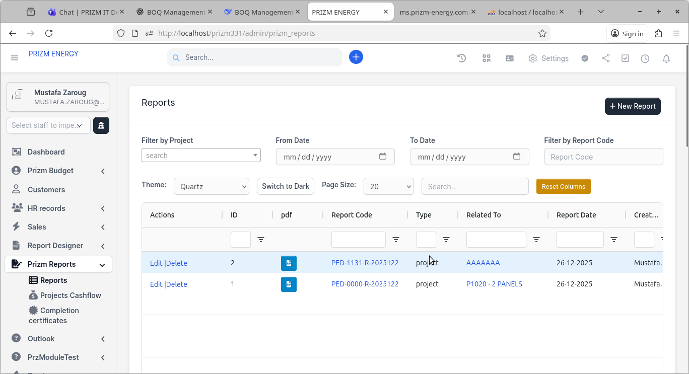
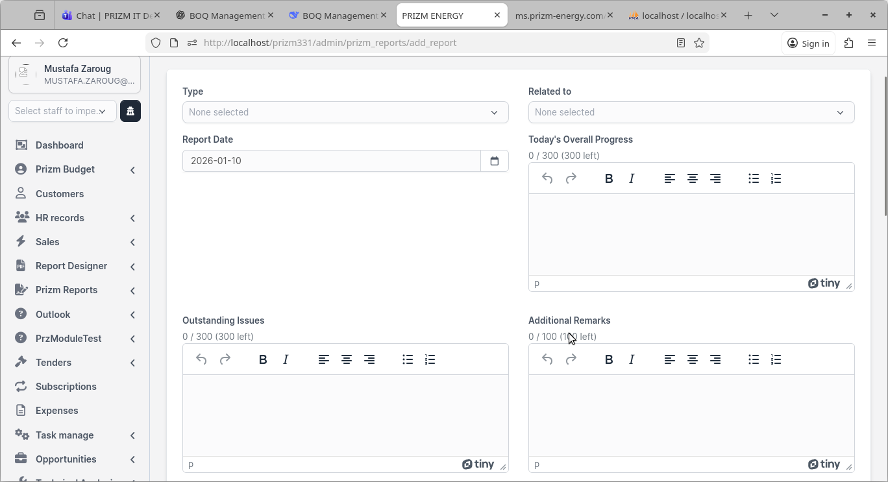
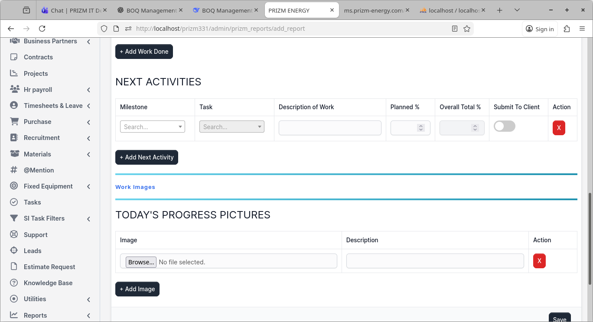
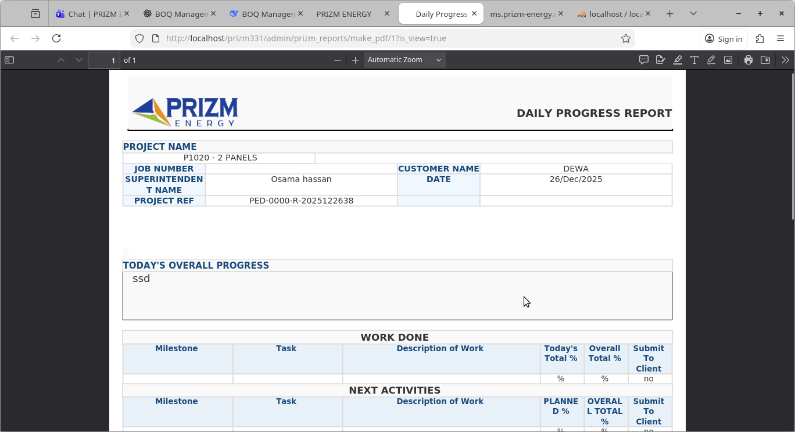
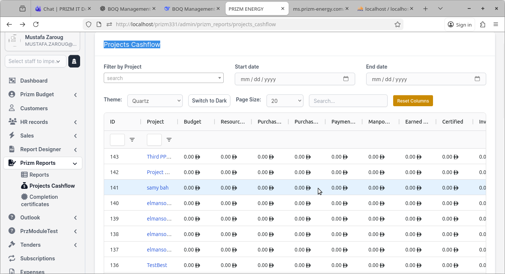
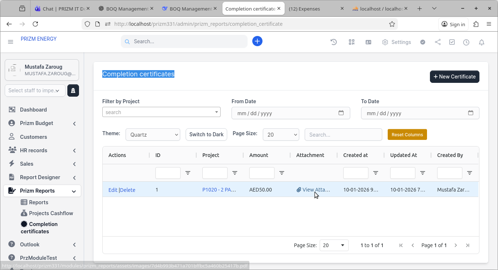
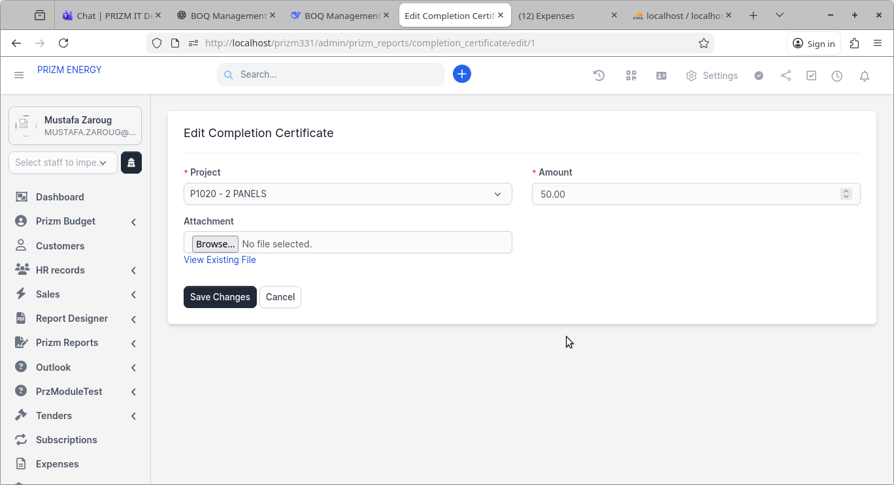

# Prizm Reports Module User Guide

## 1. Overview

The **Prizm Reports** module enables teams to create, manage, and export daily project progress reports, track project cashflow snapshots, and manage completion certificates — all within the PRIZM ENERGY management portal.

Key capabilities:
- Create structured daily progress reports linked to projects or opportunities
- Log completed work and planned next activities with milestone/task tracking
- Attach and display today's progress pictures
- Export reports as formatted PDFs
- View consolidated project cashflow across all financial stages
- Record and store completion certificates with attachments

**Required permissions:**
- `prizm_reports` — view, create, edit, and delete daily reports
- `projects_cashflow` — access the consolidated cashflow grid
- `completion_certificates` — manage completion certificates

---

## 2. Navigation

Access all three sub-sections from the **Prizm Reports** menu in the left sidebar:

- **Prizm Reports → Reports** — daily progress reports register
- **Prizm Reports → Projects Cashflow** — consolidated project financial grid
- **Prizm Reports → Completion Certificates** — certificate management

---

## 3. Daily Progress Reports

### 3.1 Reports List

The Reports screen displays all daily progress reports in a searchable AG Grid table.

**Columns:** Actions (Edit / Delete), ID, PDF button, Report Code, Type, Related To, Report Date, Created By.

**Filters available:**
- Filter by Project
- From Date / To Date
- Filter by Report Code
- Global search and per-column filters

Click the **PDF icon** next to any report to download or view the generated PDF. Click a **Report Code** link to open the report detail.

Click **+ New Report** to create a new daily progress report.

---

### 3.2 Creating / Editing a Report

**Header fields:**

| Field | Description |
|---|---|
| Type | Select `project` or `opportunity` |
| Related To | Auto-populated based on selected Type |
| Report Date | Defaults to today; change if needed |
| Today's Overall Progress | Rich-text summary of the day's progress (max 300 chars) |
| Outstanding Issues | Issues or blockers encountered (max 300 chars) |
| Additional Remarks | Any extra notes (max 100 chars) |

> **Duplicate check:** selecting a project and date triggers an automatic check. If a report already exists for that project on that date, submission is blocked to prevent duplicates.

**Work Done table:**

Each row logs completed work:
- **Milestone** — select from project milestones
- **Task** — select from tasks under the milestone
- **Description of Work** — free-text description
- **Today's Total %** — percentage completed today
- **Overall Total %** — auto-filled from task completion data
- **Submit To Client** — toggle whether this row appears on client-facing PDF

Click **+ Add Work Done** to add more rows.

**Next Activities table:**

Each row logs planned upcoming work:
- **Milestone** — select from project milestones
- **Task** — select task
- **Description of Work** — description
- **Planned %** — planned completion percentage
- **Overall Total %** — current overall completion
- **Submit To Client** — toggle visibility on PDF

Click **+ Add Next Activity** to add more rows.

**Today's Progress Pictures:**

Upload site photos with optional descriptions:
- Click **Browse** to select an image file
- Add a description for each image
- Click **+ Add Image** to attach additional photos
- Allowed formats: gif, jpg, png, webp (max 5 MB each)

Click **Save** to submit the report. The system generates a unique Report Code in the format `PED-<project>-R-<YYYYMMDD><staff>`.

---

### 3.3 PDF Output

Clicking the PDF icon generates a formatted **Daily Progress Report** PDF containing:
- PRIZM ENERGY logo and report header
- Project Name, Job Number, Customer Name, Superintendent Name, Date, Project Ref
- Today's Overall Progress section
- Work Done table (Milestone, Task, Description, Today %, Overall %, Submit to Client)
- Next Activities table (Milestone, Task, Description, Planned %, Overall %, Submit to Client)
- Progress pictures gallery with descriptions

PDFs always reflect the latest saved version of the report.

---

## 4. Projects Cashflow

The **Projects Cashflow** screen provides a consolidated financial snapshot across all projects.

**Filters:** Filter by Project, Start Date, End Date.

**Grid columns:**

| Column | Description |
|---|---|
| ID | Record identifier |
| Project | Linked project name |
| Budget | Approved project budget |
| Resource Request | Total resource request value |
| Purchase Request | Total purchase request value |
| Purchase Order | Total purchase order value |
| Payment Request | Total payment request value |
| Manpower | Manpower cost total |
| Earned Value | Earned value from completed work |
| Certified | Certified completion amounts |
| Invoices | Total invoiced amount |
| Paid | Total paid amount |

All values aggregate only **approved** records from upstream modules (budgets, purchase flows, payments, deliveries, GRNs). Use this screen for finance reviews and project health monitoring.

---

## 5. Completion Certificates

### 5.1 Certificates List

Displays all completion certificates in an AG Grid table.

**Columns:** Actions (Edit / Delete), ID, Project, Amount, Attachment, Created At, Updated At, Created By.

**Filters:** Filter by Project, From Date, To Date.

The **Attachment** column shows a **View Attachment** link for each certificate with a file uploaded.

Click **+ New Certificate** to create a new record.

---

### 5.2 Creating / Editing a Certificate

**Fields:**

| Field | Description |
|---|---|
| Project* | Select the related project (required) |
| Amount* | Certificate value (required) |
| Attachment | Upload supporting document (pdf/doc/docx/gif/jpg/png/webp, max 5 MB) |

On edit, a **View Existing File** link appears if an attachment is already stored.

Click **Save Changes** to save or **Cancel** to discard.

---

## 6. Tips & Best Practices

- Keep the `projects_project_number` custom field populated on all projects so report codes generate correctly.
- Ensure milestones and tasks remain active; deactivated records cannot be selected in new reports (existing reports retain their stored data).
- Respond to outstanding issues noted in reports promptly — they are visible in the PDF sent to clients.
- Use descriptive captions when uploading progress pictures; these print directly in the PDF and help stakeholders understand site status.
- Keep upstream approval workflows (budgets, purchase requests, POs, payments) up to date so the cashflow grid reflects accurate totals.
- Completion certificate amounts should match the certified value recorded in the cashflow grid.
