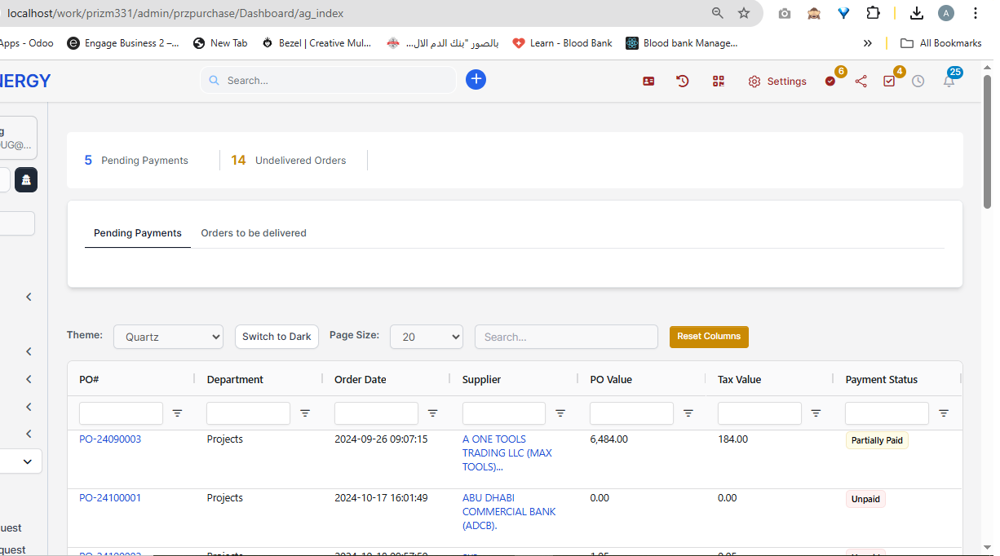
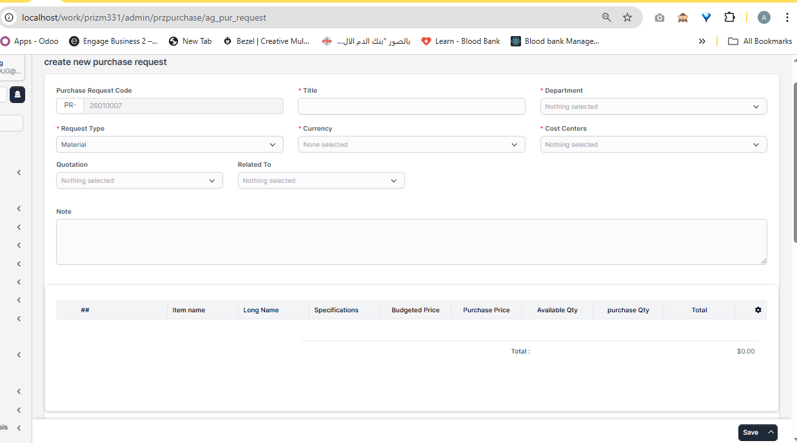
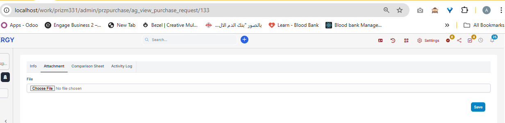
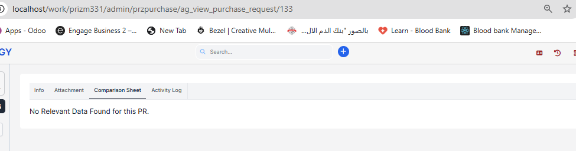
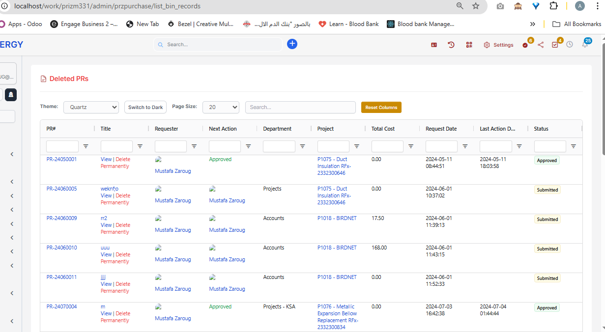

# وحدة المشتريات

## 1. المقدمة

تمثّل وحدة المشتريات في نظام Prizm القلب التشغيلي لسلسلة التوريد. فهي تدير دورة الشراء كاملة ابتداءً من إنشاء طلبات الشراء أو المصاريف داخلياً، مروراً بالتعامل مع الموردين، وإصدار أوامر الشراء، واستلام التوريدات، والفوترة، وانتهاءً بتتبع المدفوعات.

تتكامل الوحدة مع:

- المشروعات
- الإدارات
- مراكز التكلفة
- الموردين
- أنظمة الميزانية والمصروفات
- سير عمل الموافقات
- تتبع المدفوعات

## 2. نظرة عامة على الوحدة

توفّر وحدة المشتريات أدوات شاملة لـ:

- إنشاء طلبات الشراء وإدارتها
- معالجة طلبات المصاريف
- إصدار وتتبع أوامر الشراء
- إدارة علاقات الموردين
- تسجيل عمليات التسليم والاستلام
- معالجة طلبات الدفع
- حفظ سجلات الموافقات وأثر التدقيق

## 3. هيكل التنقل

تنظَّم الوحدة على النحو التالي:

```
وحدة المشتريات في Prizm
├─ الشبكة (Grid)
├─ لوحة المعلومات
├─ طلب الشراء
├─ طلب المصروف
├─ رصيد عناصر الشراء
├─ أمر الشراء
├─ رصيد أوامر الشراء
├─ الموردون
├─ عروض الأسعار
├─ عناصر عروض الأسعار
├─ سندات الاستلام
├─ رصيد سندات الاستلام
├─ طلب الدفع
├─ ملاحظات التسليم
├─ رصيد ملاحظات التسليم
├─ الملخص
├─ سجلات الموافقة
└─ الإعدادات
```

## 4. لوحة المعلومات

### الهدف

تقديم نظرة فورية على نشاط التوريد.



### العناصر الرئيسية

- إجمالي طلبات الشراء حسب الحالة
- أوامر الشراء (مسودة / مقدَّمة / معتمدة)
- المدفوعات المعلّقة
- الأوامر غير المسلّمة

### الفلاتر المتاحة

- الإدارة
- المشروع
- المورد

### الفوائد

- رؤية تشغيلية فورية
- مفيدة للرقابة الإدارية
- وصول سريع لمؤشرات الأداء الأساسية

## 5. طلبات الشراء (PR)

### 5.1 نظرة عامة

تُستخدم طلبات الشراء لطلب البضائع أو الخدمات داخلياً قبل التواصل مع الموردين، وهي نقطة الانطلاق في عملية الشراء.


تعرض شاشة طلب الشراء ما يلي:

- **إحصاءات مختصرة**: عرض سريع لحالات الطلبات (مسودة، معتمدة، مرفوضة، مقدمة، منتهية)
- **خيارات التصفية**: الإدارة، المشروع، مركز التكلفة، المسؤول عن الإجراء التالي، التواريخ
- **قائمة الطلبات**: جدول تفصيلي يحتوي على رقم الطلب، العنوان، مقدم الطلب، الإجراء التالي، الإدارة، مركز التكلفة، التكلفة الإجمالية، تاريخ الطلب، الحالة
- **أزرار الإجراءات**: إنشاء طلبات جديدة وإدارة سجلات الأرشيف
- **مفتاح التبديل نشط / عام**: للانتقال بين الطلبات النشطة والعامة

### 5.2 إنشاء طلب شراء



**البيانات المطلوبة:**

- كود طلب الشراء (يتولد تلقائياً أو يدوي)
- اسم الطلب
- الإدارة
- المشروع (اختياري لكنه مستحسن)
- مركز التكلفة (إلزامي إذا كان مفعلاً)
- العملة
- نوع الطلب (مواد / خدمات)
- الملاحظات



**تفاصيل العناصر:**

- اسم العنصر
- المواصفات
- الكمية
- سعر الوحدة
- الضريبة
- المجموع الفرعي (يُحسب تلقائياً)

**ورقة المقارنة:**



### 5.3 سير الموافقة

`
مسودة
 └─ مقدَّم
     └─ معتمد
         └─ محوّل إلى أمر شراء
     └─ مرفوض (قابل للإعادة)
`


### 5.4 أنواع الحالات

- **مسودة**: قيد الإعداد
- **مقدَّم**: بانتظار المراجعة
- **معتمد**: جاهز للتحويل إلى أمر شراء
- **مرفوض**: يجب معالجته وإعادة تقديمه
- **منتهي**: انتهت صلاحيته ولم يُستكمل

### 5.5 إجراءات الطلب

- عرض التفاصيل
- تعديل الطلب (حسب الصلاحيات)
- استنساخ طلب مشابه
- إلغاء الطلب

### 5.6 سجلات المحذوفات (Bin Records)

يحتفظ قسم **سجلات المحذوفات** بطلبات الشراء التي تم حذفها من القائمة الرئيسية، مما يتيح مراجعتها أو إزالتها نهائياً.



**الإجراءات:**

- **عرض (View)**: فتح الطلب المحذوف لمراجعة تفاصيله.
- **حذف نهائي (Delete Permanently)**: إزالة الطلب من النظام بشكل كامل. لا يمكن التراجع عن هذا الإجراء.

### 5.7 سجل النشاط (Activity Log)


## 6. طلبات المصروف

### 6.1 الهدف

متابعة النفقات التشغيلية أو مصاريف السفر أو غيرها من المصروفات التي لا تتطلب شراء مواد.

### 6.2 الحقول الأساسية

- نوع المصروف
- التاريخ
- القيمة
- مركز التكلفة / المشروع
- المستندات الداعمة

### 6.3 سير الموافقة

مشابه لطلبات الشراء مع إمكان إضافة مراجعات من الإدارة المالية.

## 7. رصيد عناصر الشراء

قائمة بالأصناف التي لم تُشتر بعد أو تنتظر التخصيص في أوامر شراء.

### استخدامات رئيسية

- تجميع الطلبات المتشابهة
- تحسين التفاوض مع الموردين
- مراقبة العناصر المؤجلة

## 8. أوامر الشراء (PO)

### 8.1 الإنشاء

يمكن إنشاء أمر الشراء من طلب معتمد أو مباشرة (للمستخدمين المخولين).

**حقول نموذج أمر الشراء:**

- رقم أمر الشراء
- المورد
- تاريخ الطلب وتاريخ التسليم المتوقع
- شروط الدفع
- شروط الشحن
- عناصر أمر الشراء (مأخوذة من الطلبات أو مضافة يدوياً)

### 8.2 الحالات

- مسودة
- مقدَّم
- معتمد
- مسلّم جزئياً
- مكتمل
- ملغى

### 8.3 الإجراءات

- إرسال إلى المورد عبر البريد الإلكتروني
- طباعة أمر الشراء
- تعديل الشروط أو العناصر (حسب الحالة)
- إرفاق مستندات داعمة

## 9. عروض الأسعار والموردون

### 9.1 إدارة الموردين

- إضافة وتحديث بيانات المورد
- تصنيف الموردين حسب الفئات
- متابعة تقييم المورد وجودة الخدمة

### 9.2 عروض الأسعار

- تسجيل عروض الأسعار المستلمة
- مقارنة الأسعار والشروط
- ربط العرض بطلب الشراء أو أمر الشراء

## 10. سندات الاستلام وملاحظات التسليم

### 10.1 سندات الاستلام

تسجّل الكميات المستلمة فعلياً، وتُستخدم لمطابقة الفواتير والمخزون.

### 10.2 ملاحظات التسليم

توثّق عملية تسليم المواد إلى مواقع العمل أو الإدارات.

### 10.3 الأرصدة الخلفية

- متابعة السندات أو الملاحظات التي تنتظر المعالجة
- معالجة الاستلام الجزئي

## 11. طلبات الدفع

- إنشاء طلبات الدفع بناءً على أوامر الشراء والفواتير
- تحديد نوع الدفع (تحويل، شيك، نقدي)
- ربط المستندات الداعمة
- تتبع حالة الدفع

## 12. سجل الموافقات

يوفر أثراً واضحاً لكل خطوة مراجعة أو اعتماد، بما يشمل التاريخ، الشخص، والقرار.

## 13. الإعدادات

- تعريف أنواع الطلبات
- ضبط مراكز التكلفة
- إعداد التسلسل الترميزي
- تحديد حدود الموافقات لكل دور

## 14. التقارير والملخص

### تقارير قياسية

- تقرير أوامر الشراء حسب الحالة
- تقرير طلبات الشراء حسب الإدارة أو المشروع
- تقرير المدفوعات المعلقة
- تقرير الموردين والأداء

### الفوائد

- شفافية كاملة
- وثائق امتثال
- تتبع الأداء
- مساءلة القرارات

## 15. الأدوار والصلاحيات

### أدوار المستخدمين

- **الموظف**: إنشاء الطلبات والاطلاع على طلباته
- **مدير الإدارة**: اعتماد طلبات الإدارة
- **مدير المشروع**: اعتماد طلبات المشروع
- **مدير مشروع أول**: صلاحيات اعتماد أعلى
- **المالية**: معالجة المدفوعات والرقابة
- **معتمدون مخصصون**: أدوار موافقة متخصصة

### أنواع الصلاحيات

- عرض كل السجلات أو السجلات الخاصة
- إنشاء السجلات
- تعديل السجلات
- حذف السجلات
- اعتماد الطلبات

### الأمان

توفر الوحدة تحكماً دقيقاً بالصلاحيات لضمان التفويض المناسب وسلامة البيانات.

## 16. السمات الرئيسية

### نقاط القوة

- تغطية شاملة لدورة التوريد
- ضوابط قوية للموافقة والتدقيق
- وضوح في فصل المهام
- قابلية التوسع للمؤسسات الكبيرة
- فرض الرقابة على الميزانية
- دعم العملات المتعددة
- تتبع المشاريع والإدارات

### نقاط التكامل

- إدارة المشاريع
- أنظمة الميزانية
- هيكل الإدارات
- توزيع مراكز التكلفة
- المحاسبة المالية
- سير الموافقات

## 17. أفضل الممارسات في سير العمل

### لمقدمي الطلبات

1. تقديم مواصفات تفصيلية
2. ربط الطلب بالمشروعات ومراكز التكلفة الصحيحة
3. التحقق من توافر الميزانية
4. إرسال الطلب للموافقة بسرعة
5. الرد سريعاً على ملاحظات الرفض

### للموافقين

1. مراجعة الطلبات بعناية
2. التأكد من الميزانية المتاحة
3. التحقق من المبرر التجاري
4. تقديم أسباب واضحة عند الرفض
5. اعتماد أو رفض الطلب دون تأخير

### لفريق التوريد

1. تجميع العناصر المتشابهة لتحسين التفاوض
2. التفاوض على أفضل الأسعار
3. الحفاظ على علاقة جيدة مع الموردين
4. متابعة جداول التسليم
5. تسجيل الاستلام بدقة

### لفريق المالية

1. التحقق من دقة الفاتورة
2. مطابقة الفاتورة مع أمر الشراء
3. التأكد من استلام البضائع
4. معالجة المدفوعات في الوقت المحدد
5. حفظ سجلات المدفوعات

## 18. نصائح للاستخدام الفعّال

### نصائح عامة

- استخدم لوحة المعلومات للمراجعة اليومية
- فعّل تنبيهات البريد الإلكتروني
- حافظ على بيانات الموردين محدثة
- استخدم الفلاتر للعثور على السجلات بسهولة
- صدّر التقارير للتحليل

### ميزات توفير الوقت

- تنفيذ الإجراءات المجمعة حيثما أمكن
- استخدام قوالب للطلبات المتكررة
- الاعتماد على الفلاتر السريعة والبحث
- عرض السجلات حسب الحالة
- الاستفادة من الحسابات التلقائية

### الامتثال

- اتباع تسلسل الموافقات
- توثيق جميع القرارات
- إرفاق المستندات الداعمة المناسبة
- استخدام تعليقات الموافقة بفاعلية
- مراجعة العناصر المعلقة بانتظام

## 19. الخلاصة

توفّر وحدة المشتريات في Prizm نظاماً متكاملاً وقابلاً للتدقيق لإدارة دورة التوريد كاملة من الطلب الأولي وحتى الدفع، مع ضمان الامتثال والشفافية والكفاءة.

### خطوات البدء

1. التعرّف على لوحة المعلومات
2. فهم دورك وصلاحياتك
3. تعلم سير الموافقة
4. إنشاء طلبات تجريبية للتدريب
5. التواصل مع المشرف للحصول على الدعم

### الدعم

للمساعدة في استخدام وحدة المشتريات، يُرجى التواصل مع مسؤول النظام أو فريق الدعم الداخلي.
