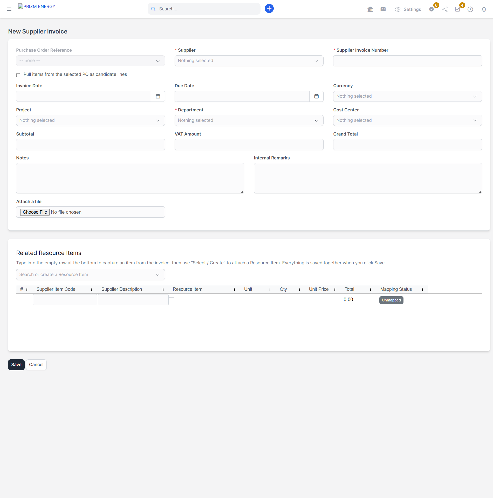
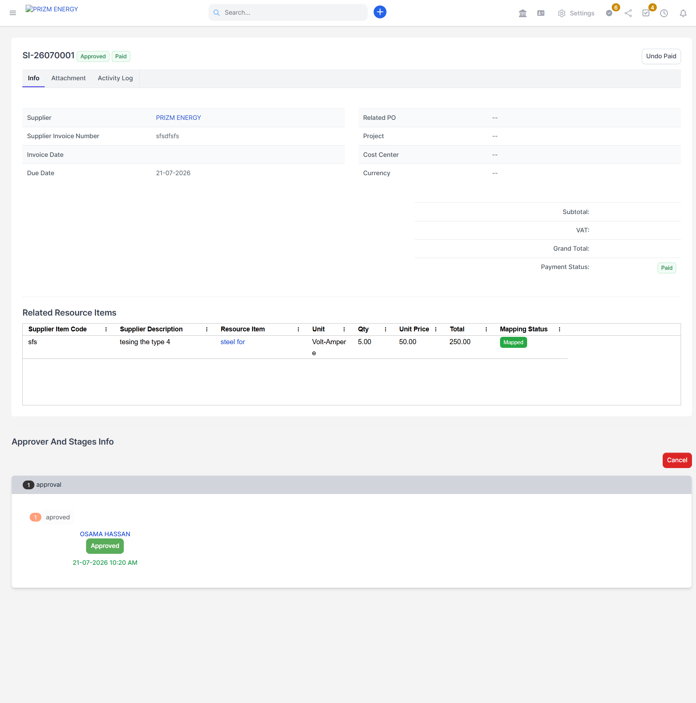

# وحدة المشتريات

## 1. المقدمة

تمثّل وحدة المشتريات في نظام Prizm القلب التشغيلي لسلسلة التوريد. فهي تدير دورة الشراء كاملة ابتداءً من إنشاء طلبات الشراء أو المصاريف داخلياً، مروراً بالتعامل مع الموردين، وإصدار أوامر الشراء، واستلام التوريدات، والفوترة، وانتهاءً بتتبع المدفوعات.

تتكامل الوحدة مع:

- المشروعات
- الإدارات
- مراكز التكلفة
- الموردين
- أنظمة الميزانية والمصروفات
- سير عمل الموافقات
- تتبع المدفوعات

## 2. نظرة عامة على الوحدة

توفّر وحدة المشتريات أدوات شاملة لـ:

- إنشاء طلبات الشراء وإدارتها
- معالجة طلبات المصاريف
- إصدار وتتبع أوامر الشراء
- إدارة علاقات الموردين
- تسجيل عمليات التسليم والاستلام
- معالجة طلبات الدفع
- حفظ سجلات الموافقات وأثر التدقيق

## 3. هيكل التنقل

تنظَّم الوحدة على النحو التالي:

```
وحدة المشتريات في Prizm
├─ الشبكة (Grid)
├─ لوحة المعلومات
├─ طلب الشراء
├─ طلب المصروف
├─ رصيد عناصر الشراء
├─ أمر الشراء
├─ رصيد أوامر الشراء
├─ الموردون
├─ عروض الأسعار
├─ عناصر عروض الأسعار
├─ سندات الاستلام
├─ رصيد سندات الاستلام
├─ طلب الدفع
├─ ملاحظات التسليم
├─ رصيد ملاحظات التسليم
├─ الملخص
├─ سجلات الموافقة
└─ الإعدادات
```

## 4. لوحة المعلومات

### الهدف

تقديم نظرة فورية على نشاط التوريد.


### العناصر الرئيسية

- إجمالي طلبات الشراء حسب الحالة
- أوامر الشراء (مسودة / مقدَّمة / معتمدة)
- المدفوعات المعلّقة
- الأوامر غير المسلّمة

### الفلاتر المتاحة

- الإدارة
- المشروع
- المورد

### الفوائد

- رؤية تشغيلية فورية
- مفيدة للرقابة الإدارية
- وصول سريع لمؤشرات الأداء الأساسية

## 5. طلبات الشراء (PR)

### 5.1 نظرة عامة

تُستخدم طلبات الشراء لطلب البضائع أو الخدمات داخلياً قبل التواصل مع الموردين، وهي نقطة الانطلاق في عملية الشراء.


تعرض شاشة طلب الشراء ما يلي:

- **إحصاءات مختصرة**: عرض سريع لحالات الطلبات (مسودة، معتمدة، مرفوضة، مقدمة، منتهية)
- **خيارات التصفية**: الإدارة، المشروع، مركز التكلفة، المسؤول عن الإجراء التالي، التواريخ
- **قائمة الطلبات**: جدول تفصيلي يحتوي على رقم الطلب، العنوان، مقدم الطلب، الإجراء التالي، الإدارة، مركز التكلفة، التكلفة الإجمالية، تاريخ الطلب، الحالة
- **أزرار الإجراءات**: إنشاء طلبات جديدة وإدارة سجلات الأرشيف
- **مفتاح التبديل نشط / عام**: للانتقال بين الطلبات النشطة والعامة

### 5.2 إنشاء طلب شراء


**دليل الحقول:**

1. **العنوان** - اسم/موضوع طلب الشراء (مطلوب)
2. **القسم** - القسم الطالب (مطلوب)
3. **نوع الطلب** - مواد أو خدمات (مطلوب)
4. **العملة** - عملة المعاملة (مطلوب)
5. **مراكز التكلفة** - فئة تخصيص الميزانية (مطلوب)
6. **عرض السعر** - ربط بعرض سعر موجود
7. **مرتبط بـ** - ربط بمشروع أو كيان
8. **جدول العناصر** - بنود مع المواصفات والأسعار

**البيانات المطلوبة:**

- كود طلب الشراء (يتولد تلقائياً أو يدوي)
- اسم الطلب
- الإدارة
- المشروع (اختياري لكنه مستحسن)
- مركز التكلفة (إلزامي إذا كان مفعلاً)
- العملة
- نوع الطلب (مواد / خدمات)
- الملاحظات


**تفاصيل العناصر:**

- اسم العنصر
- المواصفات
- الكمية
- سعر الوحدة
- الضريبة
- المجموع الفرعي (يُحسب تلقائياً)

**ورقة المقارنة:**


### 5.3 سير الموافقة

`
مسودة
 └─ مقدَّم
     └─ معتمد
         └─ محوّل إلى أمر شراء
     └─ مرفوض (قابل للإعادة)
`


### 5.4 أنواع الحالات

- **مسودة**: قيد الإعداد
- **مقدَّم**: بانتظار المراجعة
- **معتمد**: جاهز للتحويل إلى أمر شراء
- **مرفوض**: يجب معالجته وإعادة تقديمه
- **منتهي**: انتهت صلاحيته ولم يُستكمل

### 5.5 إجراءات الطلب

- عرض التفاصيل
- تعديل الطلب (حسب الصلاحيات)
- استنساخ طلب مشابه
- إلغاء الطلب

### 5.6 سجلات المحذوفات (Bin Records)

يحتفظ قسم **سجلات المحذوفات** بطلبات الشراء التي تم حذفها من القائمة الرئيسية، مما يتيح مراجعتها أو إزالتها نهائياً.


**الإجراءات:**

- **عرض (View)**: فتح الطلب المحذوف لمراجعة تفاصيله.
- **حذف نهائي (Delete Permanently)**: إزالة الطلب من النظام بشكل كامل. لا يمكن التراجع عن هذا الإجراء.

### 5.7 سجل النشاط (Activity Log)


## 6. طلبات المصروف

### 6.1 الهدف

متابعة النفقات التشغيلية أو مصاريف السفر أو غيرها من المصروفات التي لا تتطلب شراء مواد.


### 6.2 الحقول الأساسية

- نوع المصروف
- التاريخ
- القيمة
- مركز التكلفة / المشروع
- المستندات الداعمة

### إنشاء طلب مصروف


**دليل الحقول:**

1. **العنوان** - وصف المصروف (مطلوب)
2. **القسم** - القسم الطالب (مطلوب)
3. **العملة** - عملة المعاملة (مطلوب)
4. **نوع الخصم** - طريقة حساب الخصم
5. **مراكز التكلفة** - فئة تخصيص الميزانية (مطلوب)
6. **مرتبط بـ** - ربط بمشروع أو كيان
7. **جدول العناصر** - بنود المصروفات مع الأسعار

### 6.3 سير الموافقة

مشابه لطلبات الشراء مع إمكان إضافة مراجعات من الإدارة المالية.


### 6.4 سجلات المحذوفات (Bin Records)


## 7. رصيد عناصر الشراء

قائمة بالأصناف التي لم تُشتر بعد أو تنتظر التخصيص في أوامر شراء.


### استخدامات رئيسية

- تجميع الطلبات المتشابهة
- تحسين التفاوض مع الموردين
- مراقبة العناصر المؤجلة

## 8. أوامر الشراء (PO)


### 8.1 الإنشاء


**دليل الحقول:**

1. **العنوان** - وصف أمر الشراء (مطلوب)
2. **العملة** - عملة المعاملة (مطلوب)
3. **المورد** - اختيار المورد (مطلوب)
4. **تاريخ التسليم** - تاريخ التسليم المتوقع
5. **القسم** - القسم الطالب (مطلوب)
6. **موقع التسليم** - عنوان تسليم البضائع
7. **نوع الطلب** - مواد أو خدمات (مطلوب)
8. **مرتبط بـ** - ربط بمشروع أو كيان
9. **جدول العناصر** - بنود من طلب الشراء

يمكن إنشاء أمر الشراء من طلب معتمد أو مباشرة (للمستخدمين المخولين).

**حقول نموذج أمر الشراء:**

- رقم أمر الشراء
- المورد
- تاريخ الطلب وتاريخ التسليم المتوقع
- شروط الدفع
- شروط الشحن
- عناصر أمر الشراء (مأخوذة من الطلبات أو مضافة يدوياً)

### عرض وتعديل أوامر الشراء


### مراجعة مسودة أمر الشراء


### 8.2 الحالات

- مسودة
- مقدَّم
- معتمد
- مسلّم جزئياً
- مكتمل
- ملغى

### 8.3 الإجراءات

- إرسال إلى المورد عبر البريد الإلكتروني
- طباعة أمر الشراء
- تعديل الشروط أو العناصر (حسب الحالة)
- إرفاق مستندات داعمة

### السجلات المحذوفة (أوامر الشراء)


## 9. عروض الأسعار والموردون

### 9.1 نظرة عامة على الموردين


### 9.2 إدارة الموردين

**إضافة مورد جديد:**


**دليل الحقول (الخطوة 1):**

1. **الشركة** - اسم شركة المورد (مطلوب)
2. **رقم ضريبة القيمة المضافة** - رقم التسجيل الضريبي
3. **الهاتف** - رقم هاتف التواصل
4. **مجال التوريد** - مجال العمل (مطلوب)
5. **تخصص المورد** - مجال الخبرة
6. **فئة المورد** - تصنيف المورد
7. **العملة** - عملة المعاملة الافتراضية


**دليل الحقول (الخطوة 2):**

1. **العنوان** - عنوان الشارع
2. **المدينة** - اسم المدينة
3. **المنطقة** - المنطقة أو الولاية
4. **الرمز البريدي** - الرمز البريدي
5. **الدولة** - اختيار الدولة


**الإضافة الجماعية:**


### 9.3 مجموعات الموردين

إدارة الشركات الأم ومجموعات الموردين المتنوعة.


### 9.4 إدارة جهات الاتصال

إدارة جهات الاتصال الخاصة بكل مورد.


**إضافة جهة اتصال:**


**دليل الحقول:**

1. **الاسم الأول** - الاسم الأول لجهة الاتصال (مطلوب)
2. **الاسم الأخير** - اسم العائلة (مطلوب)
3. **المنصب** - المسمى الوظيفي
4. **البريد الإلكتروني** - عنوان البريد الإلكتروني (مطلوب)
5. **رقم الهاتف** - هاتف جهة الاتصال
6. **جهة اتصال رئيسية** - تحديد كجهة اتصال أساسية


- إضافة وتحديث بيانات المورد
- تصنيف الموردين حسب الفئات
- متابعة تقييم المورد وجودة الخدمة


### 9.2 عروض الأسعار


### 9.3 إنشاء وتعديل العروض


**دليل الحقول (الجزء 1):**

1. **المورد** - اختيار المورد
2. **العملة** - عملة المعاملة (مطلوب)
3. **رقم المرجع** - رقم مرجعي خارجي
4. **نوع الخصم** - طريقة حساب الخصم
5. **رقم عرض السعر** - رمز عرض السعر التلقائي (مطلوب)
6. **مرجع المورد** - رقم مرجع المورد
7. **التاريخ** - تاريخ عرض السعر (مطلوب)
8. **تاريخ الانتهاء** - فترة صلاحية العرض
9. **مرتبط بـ** - ربط بمشروع أو كيان


**دليل الحقول (الجزء 2):**

1. **جدول العناصر** - بنود مع الوصف والمواصفات والكمية والسعر والضريبة
2. **الخصم** - مبلغ أو نسبة الخصم
3. **التعديل** - قيمة تعديل السعر
4. **ملاحظة العرض** - ملاحظات إضافية للمورد
5. **الشروط والأحكام** - الشروط القانونية


### 9.4 إدارة العناصر والمرفقات


- تسجيل عروض الأسعار المستلمة
- مقارنة الأسعار والشروط
- ربط العرض بطلب الشراء أو أمر الشراء

## 10. سندات الاستلام وملاحظات التسليم

### 10.1 سندات الاستلام

تسجّل الكميات المستلمة فعلياً، وتُستخدم لمطابقة الفواتير والمخزون.

### 10.2 ملاحظات التسليم

توثّق عملية تسليم المواد إلى مواقع العمل أو الإدارات.

### 10.3 الأرصدة الخلفية

- متابعة السندات أو الملاحظات التي تنتظر المعالجة
- معالجة الاستلام الجزئي

## 11. طلبات الدفع


- إنشاء طلبات الدفع بناءً على أوامر الشراء والفواتير
- تحديد نوع الدفع (تحويل، شيك، نقدي)
- ربط المستندات الداعمة
- تتبع حالة الدفع

## 12. سجل الموافقات

يوفر أثراً واضحاً لكل خطوة مراجعة أو اعتماد، بما يشمل التاريخ، الشخص، والقرار.

## 13. الإعدادات

- تعريف أنواع الطلبات
- ضبط مراكز التكلفة
- إعداد التسلسل الترميزي
- تحديد حدود الموافقات لكل دور

## 14. التقارير والملخص

### تقارير قياسية

- تقرير أوامر الشراء حسب الحالة
- تقرير طلبات الشراء حسب الإدارة أو المشروع
- تقرير المدفوعات المعلقة
- تقرير الموردين والأداء

### الفوائد

- شفافية كاملة
- وثائق امتثال
- تتبع الأداء
- مساءلة القرارات

## 15. الأدوار والصلاحيات

### أدوار المستخدمين

- **الموظف**: إنشاء الطلبات والاطلاع على طلباته
- **مدير الإدارة**: اعتماد طلبات الإدارة
- **مدير المشروع**: اعتماد طلبات المشروع
- **مدير مشروع أول**: صلاحيات اعتماد أعلى
- **المالية**: معالجة المدفوعات والرقابة
- **معتمدون مخصصون**: أدوار موافقة متخصصة

### أنواع الصلاحيات

- عرض كل السجلات أو السجلات الخاصة
- إنشاء السجلات
- تعديل السجلات
- حذف السجلات
- اعتماد الطلبات

### الأمان

توفر الوحدة تحكماً دقيقاً بالصلاحيات لضمان التفويض المناسب وسلامة البيانات.

## 16. السمات الرئيسية

### نقاط القوة

- تغطية شاملة لدورة التوريد
- ضوابط قوية للموافقة والتدقيق
- وضوح في فصل المهام
- قابلية التوسع للمؤسسات الكبيرة
- فرض الرقابة على الميزانية
- دعم العملات المتعددة
- تتبع المشاريع والإدارات

### نقاط التكامل

- إدارة المشاريع
- أنظمة الميزانية
- هيكل الإدارات
- توزيع مراكز التكلفة
- المحاسبة المالية
- سير الموافقات

## 17. أفضل الممارسات في سير العمل

### لمقدمي الطلبات

1. تقديم مواصفات تفصيلية
2. ربط الطلب بالمشروعات ومراكز التكلفة الصحيحة
3. التحقق من توافر الميزانية
4. إرسال الطلب للموافقة بسرعة
5. الرد سريعاً على ملاحظات الرفض

### للموافقين

1. مراجعة الطلبات بعناية
2. التأكد من الميزانية المتاحة
3. التحقق من المبرر التجاري
4. تقديم أسباب واضحة عند الرفض
5. اعتماد أو رفض الطلب دون تأخير

### لفريق التوريد

1. تجميع العناصر المتشابهة لتحسين التفاوض
2. التفاوض على أفضل الأسعار
3. الحفاظ على علاقة جيدة مع الموردين
4. متابعة جداول التسليم
5. تسجيل الاستلام بدقة

### لفريق المالية

1. التحقق من دقة الفاتورة
2. مطابقة الفاتورة مع أمر الشراء
3. التأكد من استلام البضائع
4. معالجة المدفوعات في الوقت المحدد
5. حفظ سجلات المدفوعات

## 18. نصائح للاستخدام الفعّال

### نصائح عامة

- استخدم لوحة المعلومات للمراجعة اليومية
- فعّل تنبيهات البريد الإلكتروني
- حافظ على بيانات الموردين محدثة
- استخدم الفلاتر للعثور على السجلات بسهولة
- صدّر التقارير للتحليل

### ميزات توفير الوقت

- تنفيذ الإجراءات المجمعة حيثما أمكن
- استخدام قوالب للطلبات المتكررة
- الاعتماد على الفلاتر السريعة والبحث
- عرض السجلات حسب الحالة
- الاستفادة من الحسابات التلقائية

### الامتثال

- اتباع تسلسل الموافقات
- توثيق جميع القرارات
- إرفاق المستندات الداعمة المناسبة
- استخدام تعليقات الموافقة بفاعلية
- مراجعة العناصر المعلقة بانتظام

## 19. عرض الشبكة (Grid)

يوفر **عرض الشبكة** نظرة موحدة على جميع مستندات المشتريات في شاشة واحدة. يعرض المقاييس الرئيسية وروابط الوصول السريع لطلبات الشراء وأوامر الشراء وطلبات المصاريف وسندات الاستلام وطلبات الدفع وملاحظات التسليم — مما يمنح مديري المشتريات رؤية فورية عبر دورة الشراء بالكامل.

## 20. الذكاء الاصطناعي لاستخراج عروض الأسعار (AI OCR)

تتضمن وحدة عروض الأسعار إمكانيات التعرف الضوئي على الحروف (OCR) المدعومة بالذكاء الاصطناعي لاستخراج البيانات تلقائياً من عروض أسعار الموردين الممسوحة ضوئياً أو المرفوعة.

### محركات OCR المدعومة

| المحرك | الافتراضي | الوصف |
|--------|---------|-------------|
| **OpenAI** | تلقائي | استخراج سحابي بالذكاء الاصطناعي |
| **Google Gemini** | تلقائي | استخراج سحابي بالذكاء الاصطناعي |
| **Tesseract** | تلقائي | OCR محلي مفتوح المصدر |
| **Ollama** | معطل | نموذج ذكاء اصطناعي محلي (gemma3:12b) |

### خيارات إعداد الذكاء الاصطناعي

| الإعداد | الافتراضي | الوصف |
|---------|---------|-------------|
| **تفعيل الاستخراج الذكي** | مُفعّل | تشغيل/إيقاف الاستخراج الذكي لعروض الأسعار |
| **وضع الاستدعاء الواحد** | معطل | استخدام استدعاء واحد أو متعدد للاستخراج |
| **حد الثقة** | 0.7 | الحد الأدنى للثقة لقبول البيانات المستخرجة |
| **الإنشاء التلقائي للمورد** | معطل | إنشاء سجلات الموردين تلقائياً من بيانات العرض |

!!! info "الاستخراج الذكي"
    عند التفعيل، يعالج الذكاء الاصطناعي مستندات عروض الأسعار المرفوعة (PDF، صور) ويستخرج تلقائياً تفاصيل المورد وأسماء العناصر والكميات والأسعار والشروط. توضع البيانات المستخرجة في قائمة المراجعة البشرية قبل التطبيق.

## 21. بوابة الموردين

توفر **بوابة الموردين** وصولاً خارجياً للموردين للتفاعل مع نظام المشتريات.

### الميزات

- يمكن للموردين تسجيل الدخول عبر وصول مصادق
- عرض طلبات التسعير المرسلة إليهم
- تقديم عروض الأسعار ورفع المستندات
- تتبع حالة الطلبات وجداول التسليم
- تحديث معلومات الاتصال

## 22. نظام قوائم الانتظار (Backlog)

تستخدم الوحدة نمط **قائمة الانتظار** لتوفير مناطق انتقالية بين مراحل المشتريات:

| قائمة الانتظار | الغرض |
|---------|---------|
| **رصيد عناصر الشراء** | عناصر طلبات الشراء المعتمدة بانتظار تجميعها في أوامر شراء |
| **رصيد أوامر الشراء** | أوامر الشراء المعتمدة الجاهزة للمعالجة اللاحقة |
| **رصيد سندات الاستلام** | عناصر أوامر الشراء الجاهزة لتسجيل استلام البضائع |
| **رصيد ملاحظات التسليم** | العناصر الجاهزة لإنشاء ملاحظات تسليم |

!!! tip "سير عمل قوائم الانتظار"
    تمنع قوائم الانتظار العناصر من الضياع بين المراحل. يجب على فريق المشتريات مراجعتها بانتظام لضمان المعالجة في الوقت المناسب.

## 23. مرجع الصلاحيات

تستخدم الوحدة **11 مجموعة صلاحيات منفصلة** للتحكم الدقيق في الوصول:

| مجموعة الصلاحيات | التحكم في الوصول إلى |
|-----------------|-------------------|
| **przpurchase** | طلبات الشراء |
| **prz_expense_request** | طلبات المصاريف |
| **przorder** | أوامر الشراء |
| **przquotation** | عروض الأسعار |
| **przsuppliers** | الموردين |
| **prz_received_vouchers** | سندات الاستلام |
| **payment_request** | طلبات الدفع |
| **delivery_notes** | ملاحظات التسليم |
| **przsummary** | تقارير الملخص |
| **prz_approvals_logs** | سجلات الموافقات |
| **przsettings** | إعدادات الوحدة |

كل مجموعة تدعم: **عرض خاص**، **عرض (عام)**، **إنشاء**، **تعديل**، **حذف**.

## 24. البحث الشامل

وحدة المشتريات متكاملة بالكامل مع البحث الشامل على مستوى النظام. يمكنك البحث عبر جميع أنواع مستندات المشتريات:

| نوع المستند | البحث حسب | البادئة |
|--------------|-----------|--------|
| **طلب الشراء** | الرقم التسلسلي، العنوان | PR- |
| **أمر الشراء** | الرقم التسلسلي، العنوان | PO- |
| **طلب المصروف** | الرقم التسلسلي، العنوان | ER- |
| **الموردين** | اسم الشركة | — |
| **عروض الأسعار** | رمز العرض، البادئة | — |
| **سندات الاستلام** | رقم السند | MR- |
| **طلب الدفع** | الرقم التسلسلي | MT- |
| **ملاحظات التسليم** | الرقم التسلسلي | DN- |

## 25. التكامل مع المشاريع

تضيف وحدة المشتريات تبويبات إلى **عرض المشروع**:

- تبويب **طلب الشراء** — عرض جميع طلبات الشراء المرتبطة بالمشروع
- تبويب **أمر الشراء** — عرض جميع أوامر الشراء المرتبطة بالمشروع
- تبويب **الموردين** — عرض الموردين المرتبطين بالمشروع

هذا يمنح مديري المشاريع رؤية مباشرة لنشاط المشتريات في مشاريعهم.

## 26. فواتير الموردين

تدير فواتير الموردين تسجيل واعتماد وتتبع دفع الفواتير الواردة من الموردين ضمن وحدة مشتريات Prizm. ترتبط مباشرة بأوامر الشراء والموردين والمشاريع ومدير الموارد لضمان التتبع الكامل.

### كيفية الوصول

انتقل إلى **Prizm Purchase → Supplier Invoices** في قائمة الشريط الجانبي.

### قائمة فواتير الموردين (AG Grid)


تعرض القائمة جميع الفواتير في شبكة AG Grid مع فلاتر على مستوى الأعمدة وأعمدة قابلة للترتيب.

#### أعمدة الشبكة

| # | العمود | الوصف |
|---|--------|-------|
| 1 | **الإجراءات** | روابط سريعة: **عرض**، **تعديل**، **حذف**. |
| 2 | **#** | رمز الفاتورة (مثال: SI-26070001). رابط قابل للنقر. |
| 3 | **المورد** | المورد الذي أصدر الفاتورة. |
| 4 | **فاتورة المورد** | رقم الفاتورة الخاص بالمورد. |
| 5 | **تاريخ الفاتورة** | تاريخ إصدار الفاتورة. |
| 6 | **تاريخ الاستحقاق** | تاريخ استحقاق الدفع. |
| 7 | **أمر الشراء المرتبط** | أمر الشراء المرتبط، إن وُجد. |
| 8 | **المشروع** | المشروع المرتبط، إن وُجد. |
| 9 | **الإجمالي الكلي** | المبلغ النهائي شاملاً ضريبة القيمة المضافة. |
| 10 | **الحالة** | حالة الاعتماد. شارة ملونة. |
| 11 | **حالة الدفع** | حالة الدفع. شارة ملونة. |

#### الفلاتر

- **المورد** — التصفية حسب المورد
- **المشروع** — التصفية حسب المشروع
- **أمر الشراء المرتبط** — التصفية حسب أمر الشراء
- **الحالة** — التصفية حسب حالة الاعتماد

يتضمن كل رأس عمود أيقونة فلتر للتصفية المباشرة.

### إنشاء فاتورة مورد



لإنشاء فاتورة مورد:

1. انتقل إلى **Prizm Purchase → Supplier Invoices**
2. انقر على **+ New Supplier Invoice**
3. أكمل حقول النموذج
4. أضف عناصر الموارد
5. انقر على **Save**

#### حقول النموذج

| # | اسم الحقل | مطلوب | الوصف |
|---|-----------|-------|-------|
| 1 | **مرجع أمر الشراء** | لا | اختر أمر شراء لربطه. |
| 2 | **سحب بنود أمر الشراء كبنود مرشحة** | لا | خانة اختيار — تحميل بنود أمر الشراء تلقائياً. |
| 3 | **المورد** | نعم | المورد الذي أصدر الفاتورة. نجمة حمراء. |
| 4 | **رقم فاتورة المورد** | نعم | رقم الفاتورة الخاص بالمورد. نجمة حمراء. |
| 5 | **تاريخ الفاتورة** | لا | تاريخ إصدار الفاتورة. |
| 6 | **تاريخ الاستحقاق** | لا | تاريخ استحقاق الدفع. |
| 7 | **العملة** | لا | عملة الفوترة. |
| 8 | **المشروع** | لا | ربط بمشروع لتتبع التكاليف. |
| 9 | **الإدارة** | نعم | الإدارة المسؤولة. مطلوب. |
| 10 | **مركز التكلفة** | لا | تخصيص مركز التكلفة. |
| 11 | **المجموع الفرعي** | لا | الإجمالي قبل الضريبة. |
| 12 | **مبلغ ضريبة القيمة المضافة** | لا | إجمالي الضريبة. |
| 13 | **الإجمالي الكلي** | لا | المبلغ النهائي شاملاً الضريبة. |
| 14 | **الملاحظات** | لا | ملاحظات عامة للموظفين. |
| 15 | **الملاحظات الداخلية** | لا | ملاحظات داخلية فقط. |
| 16 | **إرفاق ملف** | لا | رفع مستندات داعمة. |

#### عناصر الموارد المرتبطة

| # | العمود | الوصف |
|---|--------|-------|
| 1 | **رمز عنصر المورد** | رمز كتالوج المورد. |
| 2 | **وصف المورد** | وصف المورد للعنصر. |
| 3 | **عنصر المورد** | عنصر مدير الموارد المرتبط. قابل للنقر. |
| 4 | **الوحدة** | وحدة القياس. |
| 5 | **الكمية** | الكمية المُفوترة. |
| 6 | **سعر الوحدة** | تكلفة الوحدة. |
| 7 | **الإجمالي** | الكمية × سعر الوحدة (محسوب تلقائياً). |
| 8 | **حالة الربط** | **مربوط** (أخضر) أو **غير مربوط**. |

!!! info "ربط عناصر الموارد"
    يضمن ربط عناصر المورد بعناصر الموارد الداخلية التناسق عبر المشتريات والمخزون وتتبع تكاليف المشاريع.

### حالات فاتورة المورد

**حالة الاعتماد:**

| الحالة | الوصف |
|--------|-------|
| **قيد الانتظار** | في انتظار الاعتماد. |
| **معتمدة** | تمت الموافقة من جميع المعتمدين. |
| **مرفوضة** | تم الرفض من أحد المعتمدين. |

**حالة الدفع:**

| الحالة | اللون | الوصف |
|--------|-------|-------|
| **غير مدفوعة** | — | لم تُسجَّل مدفوعات. |
| **مدفوعة** | أخضر | تمت التسوية بالكامل. |

**دورة الحياة النموذجية:**

```
إنشاء الفاتورة (قيد الانتظار) ← معتمدة ← معالجة الدفع ← مدفوعة
```

**التراجع عن الدفع:** يمكن للمستخدمين المُخوَّلين النقر على **Undo Paid** لعكس حالة الدفع.

### عرض تفاصيل فاتورة المورد



تعرض صفحة التفاصيل:

- **الترويسة:** رمز الفاتورة، شارة حالة الاعتماد، شارة حالة الدفع، زر التراجع عن الدفع
- **حقول الملخص:** المورد، رقم فاتورة المورد، التواريخ، أمر الشراء، المشروع، مركز التكلفة، العملة
- **الملخص المالي:** المجموع الفرعي، الضريبة، الإجمالي الكلي، حالة الدفع
- **جدول عناصر الموارد** مع حالة الربط
- **معلومات المعتمد والمراحل:** المرحلة، اسم المعتمد، القرار، الطابع الزمني

#### علامات التبويب

- **المعلومات (Info)** — ملخص الفاتورة والبنود والإجماليات وسجل الاعتماد
- **المرفقات (Attachment)** — رفع وإدارة المستندات الداعمة
- **سجل النشاط (Activity Log)** — سجل زمني لجميع الإجراءات

### اعتماد فاتورة المورد

يدعم النظام اعتماداً متعدد المراحل:

1. تُنشأ الفاتورة وتدخل حالة **قيد الانتظار**
2. يُخطَر المعتمدون المحددون
3. يراجع كل معتمد ويقرر **الاعتماد** أو **الرفض**
4. بعد جميع الموافقات، تتغير الحالة إلى **معتمدة**

عند الرفض: يُسجَّل السبب ويمكن تعديل الفاتورة وإعادة تقديمها.

### المطابقة الثلاثية

| المستند | ما يؤكده |
|---------|----------|
| **أمر الشراء** | العناصر والكميات والأسعار المطلوبة |
| **سند الاستلام** | العناصر والكميات المُسلَّمة فعلياً |
| **فاتورة المورد** | العناصر والكميات والأسعار المُفوترة |

!!! warning "أفضل ممارسة"
    لا تعتمد فاتورة دون التأكد من تطابقها مع أمر الشراء وسند الاستلام.

### السيناريوهات الشائعة

**تسجيل فاتورة من أمر شراء:**
انقر **+ New Supplier Invoice** ← اختر أمر الشراء ← فعّل خانة الاختيار ← تحقق من البنود ← احفظ

**إنشاء فاتورة يدوية (بدون أمر شراء):**
انقر **+ New Supplier Invoice** ← اختر المورد ← أدخل التفاصيل والبنود يدوياً ← احفظ

**اعتماد فاتورة:**
افتح الفاتورة ← راجع علامتي تبويب المعلومات والمرفقات ← انقر اعتماد أو رفض

---

## 27. الخلاصة

توفّر وحدة المشتريات في Prizm نظاماً متكاملاً وقابلاً للتدقيق لإدارة دورة التوريد كاملة من الطلب الأولي وحتى الدفع، مع ضمان الامتثال والشفافية والكفاءة.

### خطوات البدء

1. التعرّف على لوحة المعلومات
2. فهم دورك وصلاحياتك
3. تعلم سير الموافقة
4. إنشاء طلبات تجريبية للتدريب
5. التواصل مع المشرف للحصول على الدعم

### الدعم

للمساعدة في استخدام وحدة المشتريات، يُرجى التواصل مع مسؤول النظام أو فريق الدعم الداخلي.
