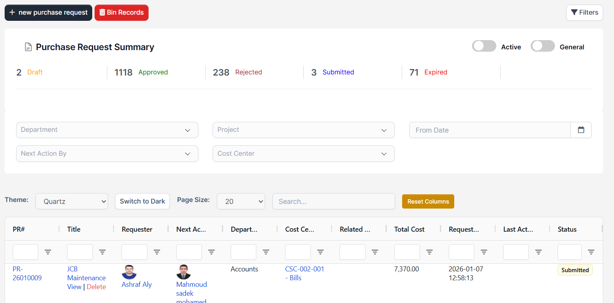

# Purchases

## 1. Introduction

The Prizm Purchase module is the core procurement system within the Prizm Management System. It manages the complete purchasing lifecycle, starting from internal demand initiation (Purchase Requests / Expense Requests) through supplier engagement, ordering, delivery, invoicing, and payment tracking.

This module is integrated with:

- Projects
- Departments
- Cost Centers
- Suppliers
- Budget & Expense systems
- Approval workflows
- Payment tracking

## 2. Module Overview

The Prizm Purchase module provides comprehensive tools for:

- Creating and managing purchase requests
- Processing expense requests
- Generating and tracking purchase orders
- Managing supplier relationships
- Recording deliveries and receipts
- Processing payment requests
- Maintaining approval logs and audit trails

## 3. Navigation Structure

The Prizm Purchase module is organized as follows:

```
Prizm Purchase
├─ Grid
├─ Dashboard
├─ Purchase Request
├─ Expense Request
├─ Purchase Items Backlog
├─ Purchase Order
├─ Purchase Order Backlog
├─ Suppliers
├─ Quotations
├─ Quotation Items
├─ Received Vouchers
├─ Received Vouchers Backlog
├─ Payment Request
├─ Delivery Notes
├─ Delivery Notes Backlog
├─ Summary
├─ Approval Logs
└─ Settings
```

## 4. Dashboard

### Purpose

Provides a real-time overview of procurement activity.

### Key Elements

- Total Purchase Requests by status
- Purchase Orders (Draft / Submitted / Approved)
- Pending Payments
- Undelivered Orders

### Available Filters

- Department
- Project
- Supplier

### Benefits

- Immediate operational visibility
- Useful for management oversight
- Quick access to key metrics

## 5. Purchase Requests (PR)

### 5.1 Overview

Purchase Requests are used to formally request goods or services internally before engaging with suppliers. This is the starting point of the procurement process.



The Purchase Request screen provides a comprehensive overview with:

- **Summary Statistics**: Quick view of requests by status (Draft, Approved, Rejected, Submitted, Expired)
- **Filter Options**: Department, Project, Cost Center, Next Action By, and Date filters
- **Request List**: Detailed table showing PR#, Title, Requester, Next Action, Department, Cost Center, Total Cost, Request Date, and Status
- **Action Buttons**: Create new purchase requests and manage bin records
- **Active/General Toggle**: Switch between active and general requests

### 5.2 Creating a Purchase Request

**Required Information:**

- Purchase Request Code (auto-generated or manual)
- Request Name
- Department
- Project (optional but recommended)
- Cost Center (mandatory if enabled)
- Currency
- Request Type (Material / Service)
- Notes

**Item Details:**

- Item Name
- Specification
- Quantity
- Unit Price
- Tax
- Subtotal (auto-calculated)

### 5.3 Approval Workflow

```
Draft
 → Submitted
   → Approved
     → Converted to Purchase Order
   → Rejected → Can be Resubmitted
```

### 5.4 Status Types

- **Draft** - Initial creation, not yet submitted
- **Submitted** - Awaiting approval
- **Approved** - Ready to convert to Purchase Order
- **Rejected** - Requires revision

### 5.5 Bin Records (Deleted PRs)

The **Bin Records** area stores purchase requests that have been deleted from the main list.


**Actions:**

- **View**: Open the deleted request to check details.
- **Delete Permanently**: Remove the request from the system entirely. This cannot be undone.

### 5.6 Best Practices

- Provide detailed item specifications
- Link to appropriate projects and cost centers
- Ensure budget availability before submission
- Use clear and descriptive request names

## 6. Expense Requests (ER)

### Purpose

Expense Requests are used for:

- Operational expenses
- Employee reimbursements
- Advance cash reconciliation

### Key Features

- Item-level expense tracking
- Multi-level approval workflow
- Status tracking
- Budget validation
- Link to advance cash records

### Budget Validation

The system prevents submission if expenses exceed available funds, ensuring financial control and compliance with budget limits.

### Approval Process

Expense requests follow a strict approval workflow to ensure proper authorization before payment processing.

## 7. Purchase Items Backlog

### Purpose

The Purchase Items Backlog acts as a staging area between approved Purchase Requests and Purchase Orders.

### How It Works

- Displays approved Purchase Request items not yet ordered
- Allows grouping multiple items into a single Purchase Order
- Prevents duplicate ordering
- Provides a control point for procurement

### Benefits

- Better control over procurement
- Prevents items from falling through the cracks
- Enables bulk ordering for efficiency

## 8. Purchase Orders (PO)

### 8.1 Creating Purchase Orders

Purchase Orders are created from items in the backlog.

**Required Information:**

- PO Number
- Supplier
- Department
- Project
- Currency
- Discount (if applicable)
- Delivery Location

### 8.2 Status Flow

```
Draft → Submitted → Approved → Partially Delivered → Completed → Paid
```

### 8.3 Key Features

- Direct linkage to original Purchase Requests
- Supplier-specific information
- Accurate financial calculations
- Delivery tracking
- Payment status monitoring

### 8.4 Best Practices

- Verify supplier information before submission
- Double-check pricing and quantities
- Include clear delivery instructions
- Maintain communication with suppliers

## 9. Suppliers

### Purpose

Maintain a comprehensive database of vendors and suppliers.

### Key Information

- Supplier master data
- Contact details
- Active / Inactive status
- Contact management
- Payment terms

### Usage

- Select suppliers for Purchase Orders
- Track supplier performance
- Manage supplier relationships
- Maintain updated contact information

## 10. Quotations & RFQs

### Quotations

Quotations are formal price offers from suppliers in response to Requests for Quotation (RFQs).

### Process

1. Send RFQs to multiple suppliers
2. Receive and record quotations
3. Compare supplier offers
4. Select best quotation
5. Use selected pricing for Purchase Orders

### Benefits

- Competitive pricing
- Multiple supplier options
- Documented decision-making
- Better negotiation position

## 11. Received Vouchers

### Purpose

Received Vouchers (Goods Receipt Notes) record goods and services received against Purchase Orders.

### Key Features

- Partial receipts allowed
- Updates remaining Purchase Order quantities
- Links to Delivery Notes
- Prepares items for payment processing

### When to Use

- Upon physical receipt of goods
- When services are completed
- For partial deliveries
- To trigger payment authorization

## 12. Delivery Notes

### Purpose

Delivery Notes provide formal acknowledgment of goods received.

### Key Information

- Delivery date and time
- Items received
- Quantities verified
- Condition of goods
- Linked Purchase Orders

### Importance

- Audit trail documentation
- Proof of receipt
- Dispute resolution
- Inventory management

## 13. Payment Requests

### Purpose

Payment Requests initiate payments to suppliers for goods and services received.

### Features

- Partial or full payment options
- Payment status tracking
- Integration with accounting
- Approval workflow

### Payment Status

- Pending
- Approved
- Processing
- Paid
- Rejected

### Best Practices

- Verify receipt of goods before payment
- Check invoice accuracy
- Follow approval procedures
- Maintain proper documentation

## 14. Summary & Reporting

### Summary Page

The Summary page provides aggregated views of procurement data:

- Purchase Request statistics
- Purchase Order summaries
- Payment status overview
- Filterable by department, project, or supplier

### Approval Logs

Comprehensive audit trail showing:

- Who approved or rejected requests
- Timestamp of each action
- Comments and reasons
- Complete transaction history

### Benefits

- Full transparency
- Compliance documentation
- Performance tracking
- Decision accountability

## 15. Permissions & Roles

### User Roles

- **Staff** - Create and view own requests
- **Department Manager** - Approve department requests
- **Project Manager** - Approve project-related purchases
- **Senior Project Manager** - Higher approval limits
- **Finance** - Payment processing and oversight
- **Custom Approvers** - Specialized approval roles

### Permission Types

- View all records
- View own records only
- Create new requests
- Edit existing records
- Delete records
- Approve requests

### Security

The system provides granular permission control to ensure proper authorization and data security.

## 16. Key Features

### Strengths

- End-to-end procurement coverage
- Strong approval and audit controls
- Clear separation of duties
- Scalable for large organizations
- Budget enforcement
- Multi-currency support
- Project and department tracking

### Integration Points

- Projects management
- Budget systems
- Department structures
- Cost center allocation
- Financial accounting
- Approval workflows

## 17. Workflow Best Practices

### For Requesters

1. Provide detailed specifications
2. Link to correct projects and cost centers
3. Check budget availability
4. Submit for approval promptly
5. Respond quickly to rejection feedback

### For Approvers

1. Review requests thoroughly
2. Verify budget availability
3. Check business justification
4. Provide clear rejection reasons
5. Approve or reject promptly

### For Procurement Team

1. Group similar items for efficiency
2. Negotiate best prices
3. Maintain supplier relationships
4. Track delivery timelines
5. Process receipts accurately

### For Finance Team

1. Verify invoice accuracy
2. Match to Purchase Orders
3. Confirm goods receipt
4. Process payments on time
5. Maintain payment records

## 18. Tips for Efficient Use

### General Tips

- Use dashboard for daily overview
- Set up email notifications
- Maintain up-to-date supplier information
- Use filters to find specific records
- Export reports for analysis

### Time-Saving Features

- Bulk actions where available
- Template requests for common items
- Quick filters and search
- Status-based views
- Automated calculations

### Compliance

- Follow approval hierarchies
- Document all decisions
- Maintain proper supporting documents
- Use approval comments effectively
- Regular review of pending items

## 19. Summary

The Prizm Purchase module provides a comprehensive, controlled, and auditable procurement system. It supports organizations in managing their entire procurement lifecycle from initial request through to payment, ensuring compliance, transparency, and efficiency throughout the process.

### Getting Started

1. Familiarize yourself with the dashboard
2. Understand your role and permissions
3. Learn the approval workflow
4. Practice creating sample requests
5. Contact your administrator for training

### Support

For assistance with the Prizm Purchase module, contact your system administrator or internal support team.
