# مصمم التقارير

## 1. المقدمة

**مصمم التقارير** هو أداة بناء تقارير مرئية (WYSIWYG) مدمجة في نظام إدارة بريزم. يتيح للمستخدمين تصميم تخطيطات تقارير مخصصة، والاتصال بمصادر البيانات، وربط الحقول بصرياً، وتصدير تقارير احترافية — كل ذلك من داخل المتصفح.

### القدرات الرئيسية

- الاتصال بقواعد بيانات MySQL ومصادر أخرى (PostgreSQL، SQL Server، REST API، GraphQL، JSON، CSV، Excel)
- تصميم تخطيطات تقارير مخصصة مع رؤوس وتذييلات وصفوف تفصيلية
- ربط حقول البيانات مباشرة بلوحة التقرير عبر السحب والإفلات
- معاينة التقارير ببيانات حية من قاعدة البيانات
- طباعة وتصدير التقارير (PDF، HTML، Excel، CSV، Word)
- حفظ تلقائي للتعافي من الأعطال

## 2. نظرة عامة على الوحدة

توفر وحدة مصمم التقارير أدوات شاملة لـ:

- إعداد اتصالات البيانات ومجموعات البيانات
- إنشاء وإدارة قوالب التقارير
- تصميم التقارير بمحرر مرئي كامل
- معاينة التقارير ببيانات لحظية
- تصدير التقارير بتنسيقات متعددة
- إدارة دورة حياة التقرير (مسودة، منشور، مؤرشف)

## 3. هيكل التنقل

```
مصمم التقارير
├─ إدارة التقارير
└─ الإعدادات
    ├─ الاتصالات
    ├─ مجموعات البيانات
    └─ عام
```

## 4. الوصول إلى مصمم التقارير

1. سجّل الدخول إلى نظام إدارة بريزم
2. من القائمة الجانبية اليسرى، انقر على **مصمم التقارير**
3. تظهر القوائم الفرعية:
    - **إدارة التقارير** — قائمة التقارير الرئيسية مع AG Grid
    - **الإعدادات** — الاتصالات ومجموعات البيانات والإعدادات العامة

## 5. الإعدادات: الاتصالات

**المسار:** مصمم التقارير > الإعدادات > الاتصالات

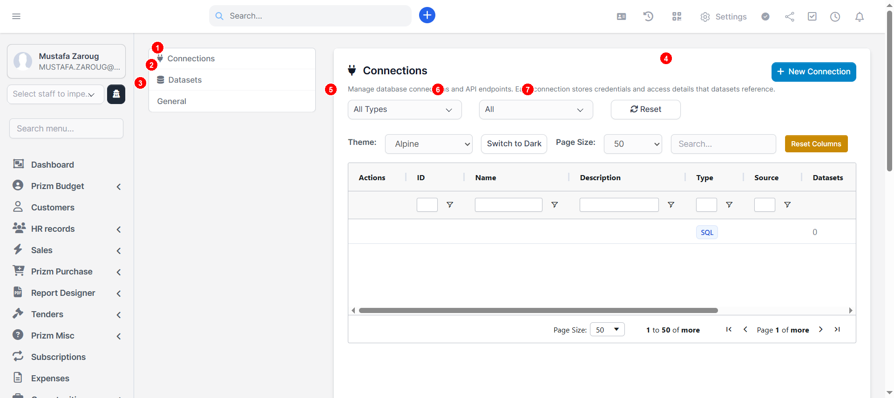

تحدد الاتصالات **أين** توجد بياناتك — خوادم قواعد البيانات أو نقاط API أو مصادر الملفات. يتم تخزين بيانات الاعتماد بأمان على الخادم (لا تُرسل أبداً إلى المتصفح).

**عناصر الشاشة:**

| # | العنصر | الوصف |
|---|---------|-------------|
| 1 | **تبويب الاتصالات** | تبويب الإعدادات النشط حالياً |
| 2 | **تبويب مجموعات البيانات** | التبديل لإدارة مجموعات البيانات |
| 3 | **تبويب عام** | التبديل للإعدادات العامة |
| 4 | **+ اتصال جديد** | إنشاء اتصال بيانات جديد |
| 5 | **فلتر النوع** | تصفية الاتصالات حسب نوع المصدر |
| 6 | **فلتر الحالة** | تصفية حسب نشط/غير نشط |
| 7 | **إعادة تعيين** | مسح جميع الفلاتر |

### إنشاء اتصال

#### الخطوة 1: اختيار نوع المصدر

انقر على **+ اتصال جديد** لفتح معالج الاتصال.

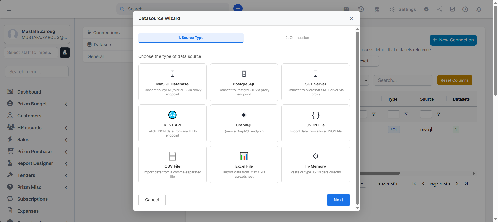

اختر من 9 أنواع مصادر مدعومة:

| الفئة | أنواع المصادر |
|----------|-------------|
| **قواعد البيانات** | MySQL، PostgreSQL، SQL Server |
| **واجهات API** | REST API، GraphQL |
| **الملفات** | ملف JSON، ملف CSV، ملف Excel |
| **أخرى** | In-Memory |

#### الخطوة 2: تفاصيل الاتصال

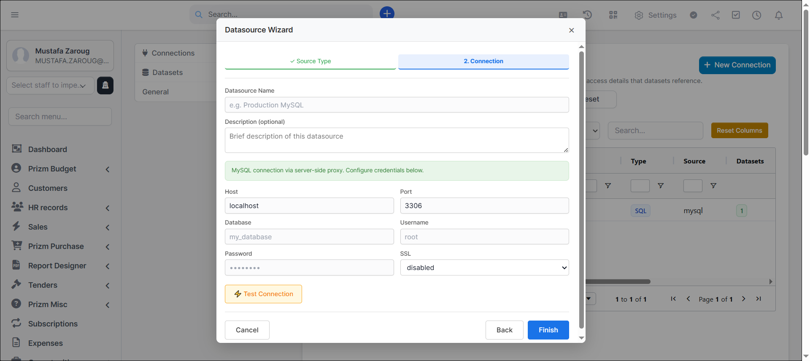

لاتصالات MySQL، املأ:

| الحقل | الوصف |
|-------|-------------|
| **الاسم** | اسم وصفي (مثال: "MySQL إنتاجي") |
| **الوصف** | ملاحظات اختيارية |
| **المضيف** | عنوان خادم قاعدة البيانات (مثال: `localhost`) |
| **المنفذ** | الافتراضي `3306` لـ MySQL |
| **قاعدة البيانات** | اسم قاعدة البيانات |
| **اسم المستخدم/كلمة المرور** | بيانات الاعتماد (تُخزن على الخادم فقط) |
| **SSL** | معطل / مطلوب / مفضل |

#### الخطوة 3: اختبار وحفظ

1. انقر **اختبار الاتصال** — يجب أن تظهر علامة خضراء
2. انقر **إنهاء** لحفظ الاتصال

---

## 6. الإعدادات: مجموعات البيانات

**المسار:** مصمم التقارير > الإعدادات > مجموعات البيانات

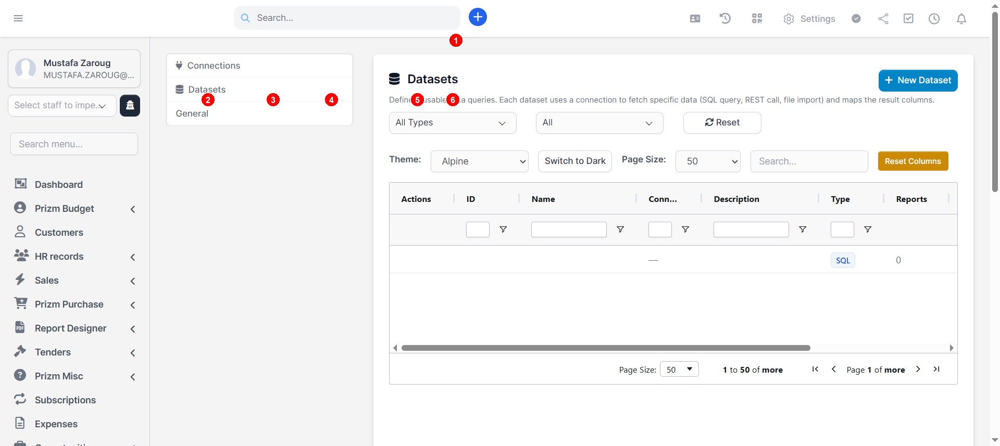

تحدد مجموعات البيانات **ما هي** البيانات المراد جلبها من اتصال. تخزن كل مجموعة استعلاماً وخريطة حقول ومرجعاً لاتصال.

**عناصر الشاشة:**

| # | العنصر | الوصف |
|---|---------|-------------|
| 1 | **+ مجموعة بيانات جديدة** | إنشاء مجموعة بيانات جديدة |
| 2 | **الإجراءات** | أيقونات تعديل (قلم) وحذف (سلة) لكل صف |
| 3 | **الاسم** | اسم مجموعة البيانات |
| 4 | **الاتصال** | اسم الاتصال المرتبط |
| 5 | **النوع** | SQL، REST، GraphQL، إلخ. |
| 6 | **التقارير** | عدد التقارير التي تستخدم هذه المجموعة |

### إنشاء مجموعة بيانات

انقر **+ مجموعة بيانات جديدة** لفتح المعالج المكون من 3 خطوات.

#### الخطوة 1: التعريف

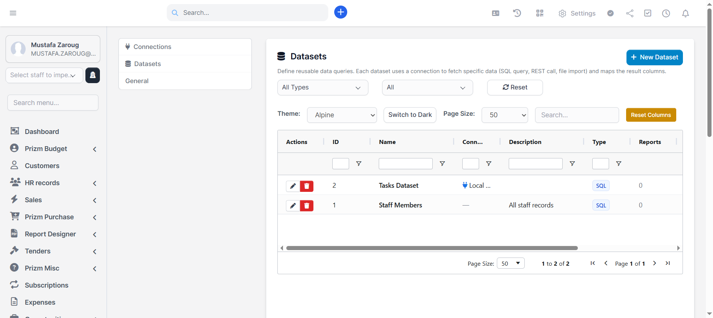

1. **اسم المجموعة** — مطلوب، يجب أن يكون فريداً
2. **الوصف** — ملاحظات اختيارية
3. **الاتصال** — اختر من القائمة المنسدلة
4. **اختبار الاتصال** — يجب أن ينجح قبل فتح قسم الاستعلام
5. **استعلام SQL** — اكتب استعلام SELECT في المحرر
6. **تنفيذ الاستعلام** — يجب أن ينجح للمتابعة؛ جدول المعاينة يعرض النتائج الأولى

#### الخطوة 2: الحقول

- تُملأ تلقائياً من نتائج الاستعلام
- تحديد/إلغاء تحديد الحقول لتضمينها
- تعديل أسماء الحقول وأنواع البيانات والتسميات

#### الخطوة 3: المعاينة

- جدول بيانات بالحقول المحددة
- ملخص الإعدادات
- انقر **إنهاء** للحفظ

---

## 7. إدارة التقارير

**المسار:** مصمم التقارير > إدارة التقارير

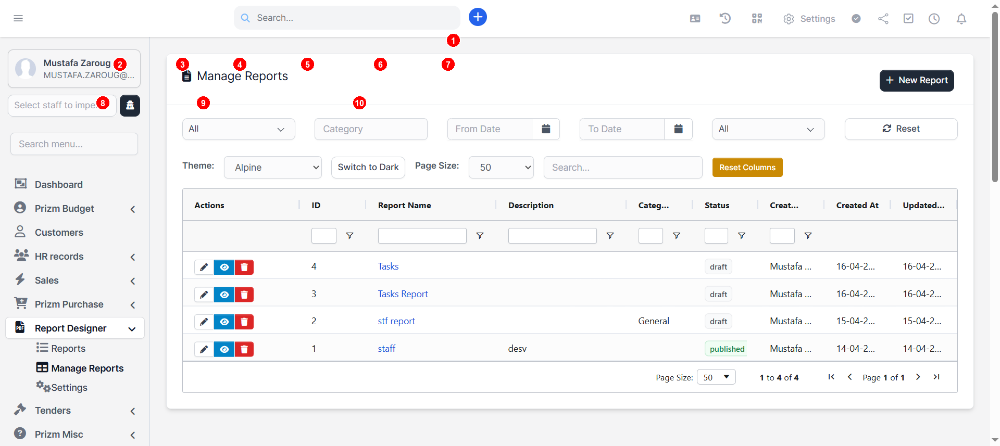

تعرض صفحة التقارير الرئيسية جميع التقارير المحفوظة في جدول AG Grid.

**عناصر الشاشة:**

| # | العنصر | الوصف |
|---|---------|-------------|
| 1 | **+ تقرير جديد** | فتح لوحة تصميم فارغة |
| 2 | **فلتر الحالة** | تصفية حسب الكل، مسودة، أو منشور |
| 3 | **فلتر الفئة** | تصفية حسب فئة التقرير |
| 4 | **من تاريخ** | تصفية حسب نطاق تاريخ الإنشاء (بداية) |
| 5 | **إلى تاريخ** | تصفية حسب نطاق تاريخ الإنشاء (نهاية) |
| 6 | **قائمة الحالة** | تصفية إضافية حسب الحالة |
| 7 | **إعادة تعيين** | مسح جميع الفلاتر |
| 8 | **الإجراءات** | إجراءات لكل تقرير: تعديل (قلم)، معاينة (عين)، حذف (سلة) |
| 9 | **اسم التقرير** | انقر لفتح التقرير |
| 10 | **الحالة** | شارة مسودة أو منشور |

---

## 8. إنشاء تقرير جديد

1. اذهب إلى **إدارة التقارير**
2. انقر **+ تقرير جديد**
3. يُفتح المصمم بلوحة فارغة
4. أضف مجموعة بيانات
5. اسحب الحقول أو المكونات على اللوحة
6. انقر **حفظ**

---

## 9. لوحة التصميم

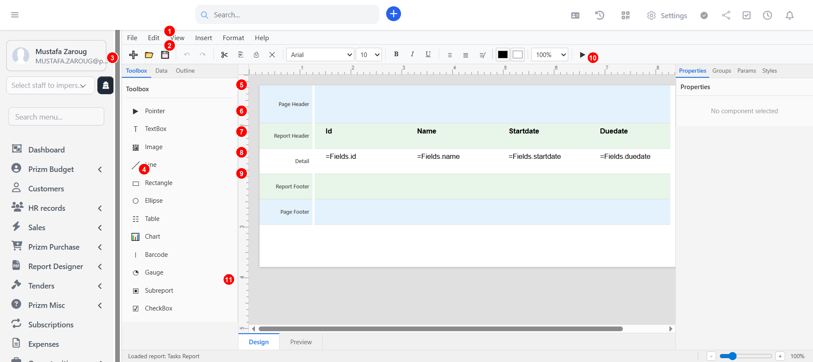

المصمم هو المحرر المرئي الأساسي بلوحات وأدوات متعددة.

**عناصر الشاشة:**

| # | العنصر | الوصف |
|---|---------|-------------|
| 1 | **شريط القوائم** | قوائم ملف، تحرير، عرض، إدراج، تنسيق، مساعدة |
| 2 | **شريط الأدوات** | أزرار سريعة: جديد، فتح، حفظ، تراجع/إعادة، قص/نسخ/لصق، تحكم الخط، تنسيق، ألوان، تكبير |
| 3 | **تبويبات اللوحة اليسرى** | صندوق الأدوات، البيانات، المخطط |
| 4 | **صندوق الأدوات** | مكونات قابلة للسحب (مربع نص، صورة، خط، مستطيل، قطع ناقص، جدول، رسم بياني، باركود، مقياس، تقرير فرعي، مربع اختيار) |
| 5 | **رأس الصفحة** | شريط يتكرر في كل صفحة |
| 6 | **رأس التقرير** | شريط يظهر في الصفحة الأولى فقط |
| 7 | **التفاصيل** | شريط يتكرر لكل صف بيانات |
| 8 | **تذييل التقرير** | شريط يظهر في الصفحة الأخيرة فقط |
| 9 | **تذييل الصفحة** | شريط يتكرر في كل صفحة |
| 10 | **اللوحة اليمنى** | تبويبات الخصائص، المجموعات، المعلمات، الأنماط |
| 11 | **تصميم / معاينة** | التبديل بين وضع التصميم والمعاينة الحية |

---

## 10. إضافة بيانات إلى التقرير

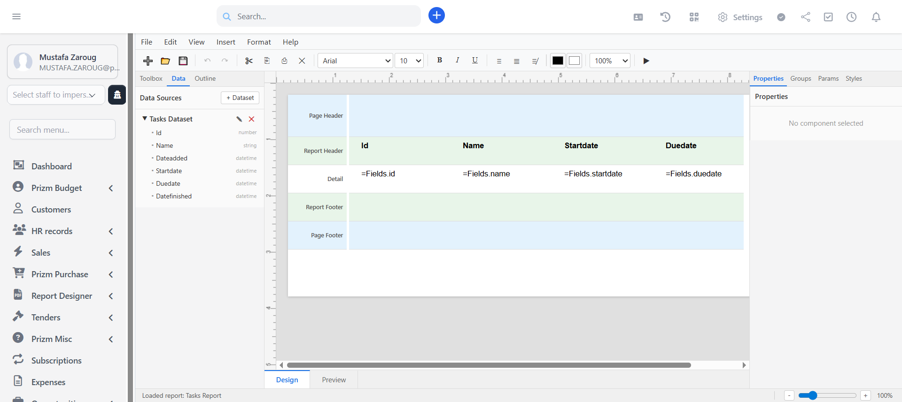

1. انقر تبويب **البيانات** في اللوحة اليسرى
2. انقر **+ مجموعة بيانات**
3. يُفتح مربع اختيار مجموعة البيانات

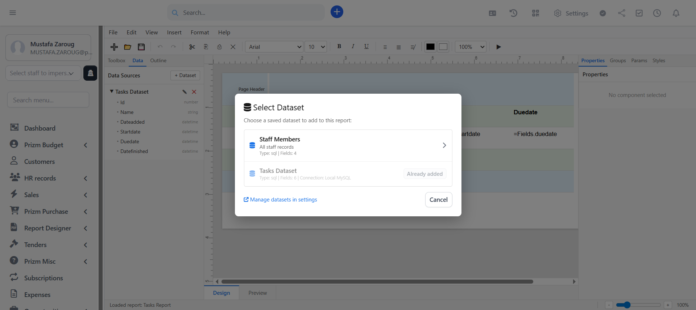

4. انقر على مجموعة بيانات لإضافتها
5. تظهر المجموعة في شجرة البيانات بحقول قابلة للتوسيع
6. **اسحب الحقول** من الشجرة إلى اللوحة لإنشاء مربعات نص مرتبطة

---

## 11. إضافة المكونات

### من صندوق الأدوات

1. انقر تبويب **صندوق الأدوات**
2. انقر على نوع المكون
3. يُدرج المكون في شريط التفاصيل

### من لوحة البيانات

- اسحب حقلاً من شجرة مجموعة البيانات إلى أي شريط
- يُنشأ **مربع نص** مرتبط بـ `=Fields.fieldname` تلقائياً
- يُنشأ تسمية رأس مطابقة في شريط رأس التقرير

### أنواع المكونات

| النوع | الوصف |
|------|-------------|
| **مربع نص** | محتوى نصي أو تعبير مرتبط بالبيانات |
| **صورة** | صورة ثابتة أو من الخادم أو عبر URL |
| **خط** | خط فاصل أفقي أو عمودي |
| **مستطيل** | شكل مستطيل بحدود |
| **قطع ناقص** | شكل دائري أو بيضاوي |
| **جدول** | جدول بيانات متعدد الأعمدة قابل لتغيير الحجم |
| **رسم بياني** | تصور بياني |
| **باركود** | عنصر باركود للتسميات والتتبع |
| **مقياس** | تصور بمقياس |
| **تقرير فرعي** | تقرير فرعي مضمن داخل التقرير الرئيسي |
| **مربع اختيار** | مربع اختيار لحقول نعم/لا |

---

## 12. حفظ التقرير

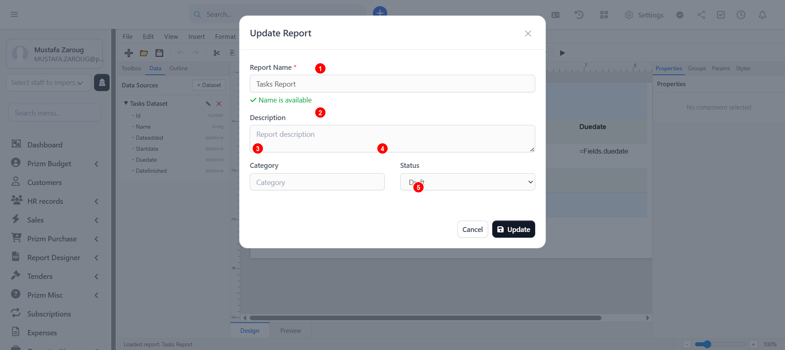

انقر **حفظ** (زر شريط الأدوات أو **Ctrl+S**) لفتح نافذة الحفظ.

| # | الحقل | مطلوب | الوصف |
|---|-------|----------|-------------|
| 1 | **اسم التقرير** | نعم | يجب أن يكون فريداً؛ التحقق اللحظي يتأكد من التوفر |
| 2 | **الوصف** | لا | وصف اختياري لغرض التقرير |
| 3 | **الفئة** | لا | فئة اختيارية للتصفية في إدارة التقارير |
| 4 | **الحالة** | نعم | مسودة أو منشور |
| 5 | **حفظ/تحديث** | — | انقر للحفظ (جديد) أو التحديث (موجود) |

### الحفظ التلقائي

- تُحفظ التقارير تلقائياً في **localStorage** للتعافي من الأعطال
- إذا أُغلق المتصفح بشكل غير متوقع، فتح "تقرير جديد" سيعرض خيار الاستعادة

---

## 13. معاينة التقرير

### من المصمم

- انقر تبويب **معاينة** في أسفل اللوحة أو اضغط **F5**

### من إدارة التقارير

- انقر أيقونة **المعاينة** (العين) على صف التقرير

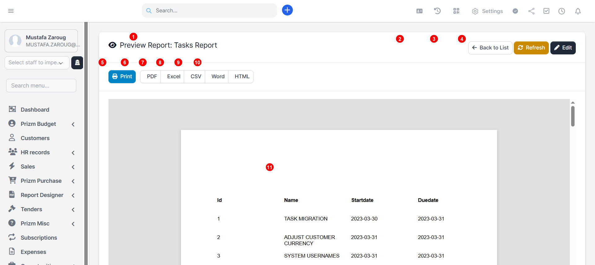

**عناصر الشاشة:**

| # | العنصر | الوصف |
|---|---------|-------------|
| 1 | **عنوان التقرير** | اسم التقرير المعاين |
| 2 | **العودة للقائمة** | الرجوع لإدارة التقارير |
| 3 | **تحديث** | إعادة تحميل التقرير بأحدث البيانات |
| 4 | **تعديل** | فتح التقرير في المصمم |
| 5 | **طباعة** | فتح مربع حوار الطباعة |
| 6 | **PDF** | تصدير كملف PDF |
| 7 | **Excel** | تصدير كملف Excel |
| 8 | **CSV** | تصدير كملف CSV |
| 9 | **Word** | تصدير كمستند Word |
| 10 | **HTML** | تنزيل كملف HTML مستقل |
| 11 | **محتوى التقرير** | صفحات التقرير المعروضة ببيانات حية |

---

## 14. العمل مع الصور

### إدراج صورة

1. انقر **صورة** في صندوق الأدوات أو استخدم **إدراج > صورة**
2. يُفتح مربع اختيار الصورة بـ 3 تبويبات:

| التبويب | الوصف |
|-----|-------------|
| **الخادم** | تصفح الصور المرفوعة مسبقاً؛ انقر **رفع صورة** لإضافة ملفات جديدة |
| **رابط URL** | لصق رابط صورة خارجي مع معاينة حية |
| **تضمين** | سحب وإفلات أو استعراض ملف محلي (يُضمن كـ base64) |

### قواعد الرفع

- التنسيقات المدعومة: JPG، PNG، GIF، SVG، WebP
- الحد الأقصى: 5 ميجابايت
- الأسماء المكررة تحصل على أرقام تسلسلية تلقائية

---

## 15. الطباعة والتصدير

| التنسيق | الطريقة |
|--------|--------|
| **PDF** | عبر مربع حوار الطباعة (حفظ كـ PDF) |
| **HTML** | تنزيل ملف .html مستقل |
| **Excel** | تصدير عبر وحدة التصدير |
| **CSV** | تصدير عبر وحدة التصدير |
| **Word** | تصدير عبر وحدة التصدير |

---

## 16. حذف التقرير

1. اذهب إلى **إدارة التقارير**
2. انقر أيقونة **الحذف** (السلة) على صف التقرير
3. أكّد مربع حوار الحذف
4. يُحذف التقرير **مؤقتاً** (يمكن استرجاعه من قاعدة البيانات)

---

## 17. اختصارات لوحة المفاتيح

| الاختصار | الإجراء |
|----------|--------|
| **Ctrl+N** | تقرير جديد |
| **Ctrl+O** | فتح تقرير |
| **Ctrl+S** | حفظ التقرير |
| **Ctrl+Z** | تراجع |
| **Ctrl+Y** | إعادة |
| **Ctrl+C** | نسخ |
| **Ctrl+V** | لصق |
| **Ctrl+X** | قص |
| **Ctrl+A** | تحديد الكل |
| **Ctrl+B** | غامق |
| **Ctrl+I** | مائل |
| **Ctrl+U** | تسطير |
| **Delete** | حذف المكون المحدد |
| **F5** | تبديل المعاينة |
| **Escape** | العودة للتصميم من المعاينة |

!!! note "مفتاح Backspace"
    لا يحذف Backspace المكونات — وذلك لمنع الحذف العرضي أثناء تحرير حقول النص. استخدم مفتاح **Delete** بدلاً من ذلك.

---

## 18. أفضل الممارسات والنصائح

- **الاتصالات تخزن بيانات الاعتماد على الخادم** — كلمات المرور لا تصل أبداً للمتصفح
- **مجموعات البيانات تشير للاتصالات** — غيّر كلمة المرور مرة واحدة وتُحدّث جميع المجموعات تلقائياً
- **استخدم لوحة البيانات** لسحب الحقول مباشرة على اللوحة لإنشاء تخطيط سريع
- **عاين بشكل متكرر** للتحقق من التخطيط مع بيانات حقيقية (F5)
- **احفظ كثيراً** — استخدم Ctrl+S؛ الحفظ التلقائي في localStorage يوفر التعافي من الأعطال
- **مكونات الجدول** تدعم تغيير حجم الأعمدة وتحرير الرؤوس
- **استخدم الفئات** لتنظيم التقارير لتسهيل التصفية
- **انشر التقارير** فقط عندما تكون نهائية وجاهزة للمستخدمين النهائيين
