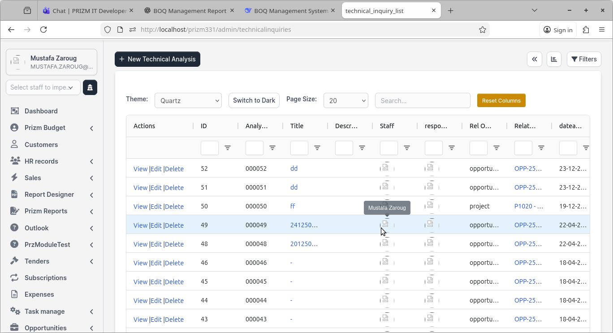
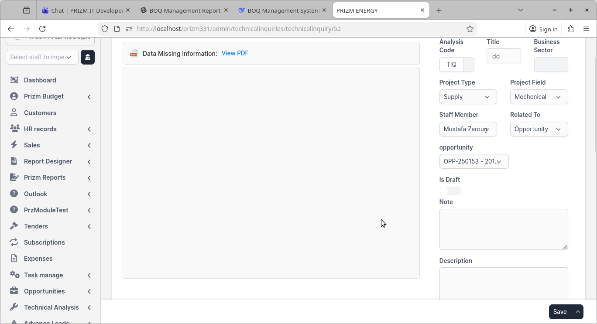
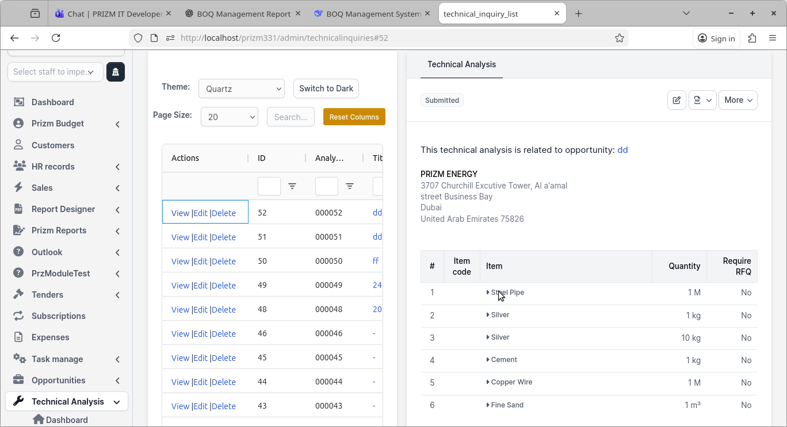
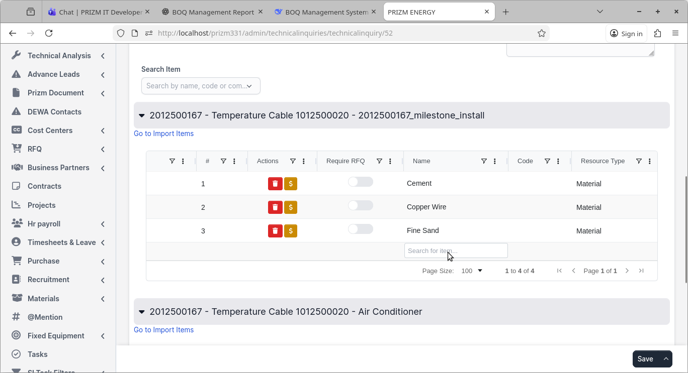
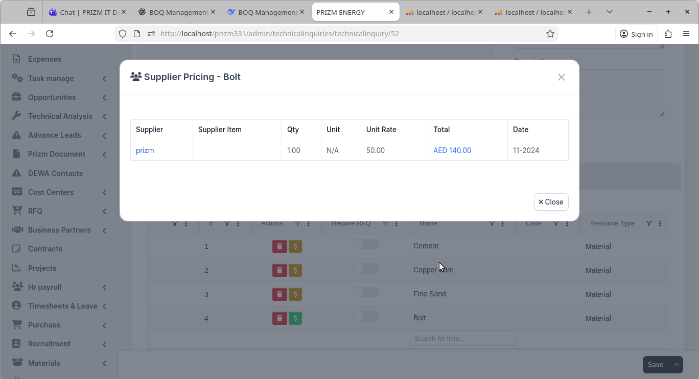

# PRIZM Technical Analysis Module – User Guide

## Overview

The **Technical Analysis** module is a core engineering governance component within the PRIZM ENERGY ERP Admin Portal. It provides a structured framework for performing, documenting, reviewing, and approving technical evaluations related to projects, opportunities, vendors, and engineering decisions.

A Technical Analysis record represents a formal technical assessment used to validate feasibility, compliance, risks, scope alignment, and engineering soundness before critical business or project decisions are finalized. The module ensures transparency, traceability, and accountability across engineering and management teams.

Technical Analysis supports:
- Engineering validation and design compliance  
- Risk identification and mitigation  
- Technical decision justification  
- Cross-department alignment  
- Audit and compliance requirements  

---

## Navigation to Technical Analysis

The Technical Analysis module is accessible from the Admin Portal main navigation menu. Users with appropriate permissions can locate it under the engineering or technical governance section of the sidebar.

Navigation typically follows:
- Admin Portal → Technical Analysis

Access visibility depends on assigned user roles and permissions.

---

## Technical Analysis Dashboard

The dashboard provides a consolidated overview of all Technical Analysis activities.

Users see:
- Summary counters by status (Draft, Under Review, Approved, Rejected, etc.)
- Recently updated Technical Analysis records
- Pending reviews and approvals
- Key engineering workload indicators

Typical users:
- Engineering managers  
- Project managers  
- Technical leads  

The dashboard helps prioritize reviews, monitor engineering throughput, and identify bottlenecks.

---

## Technical Analysis List / Register

The Technical Analysis Register displays all records in a searchable and filterable list.

Users can:
- View all Technical Analysis records
- Filter by status, type, related project or opportunity
- Sort by creation date, last update, or priority
- Open records for detailed review

This screen acts as the central control point for managing the full Technical Analysis lifecycle.

---

## Technical Analysis Creation

Creating a Technical Analysis initiates a formal technical evaluation process.

During creation, users typically define:
- Technical Analysis title and reference
- Purpose and scope of the analysis
- Related project, opportunity, or external request
- Requesting department or individual
- Assigned engineers or reviewers

Mandatory information must be completed before submission. Records are saved in **Draft** status until formally submitted for review.

Typical creators:
- Engineers  
- Project managers  
- Technical coordinators  

---

## Technical Analysis Types

The module supports multiple Technical Analysis types to cover diverse engineering use cases, including:
- Project-based Technical Analysis
- Opportunity-based Technical Analysis
- Vendor or supplier technical evaluation
- Design review and compliance assessment
- Method statement or technical proposal review

The selected type determines applicable evaluation criteria, review participants, and approval requirements.

---

## Technical Analysis Stages & Statuses

Each Technical Analysis follows a controlled lifecycle with defined statuses:

- **Draft** – Editable working version
- **Submitted** – Formally sent for review
- **Under Review** – Actively reviewed by assigned engineers
- **Clarification Required** – Additional input or revisions requested
- **Revised** – Updated after clarification
- **Approved** – Technically accepted
- **Rejected** – Not technically acceptable
- **Closed** – Finalized and archived

Status rules:
- Editing is restricted once submitted
- Approved or rejected records are locked
- Revisions require explicit resubmission
- Closed records are read-only

---

## Technical Analysis Details View

The detail view is the central workspace for each Technical Analysis record.

Users see:
- General information and metadata
- Related projects, opportunities, or vendors
- Current status and assigned reviewers
- Action buttons based on permissions and status

Actions may include:
- Submit for review
- Request clarification
- Approve or reject
- Upload supporting documents

---

## Technical Scope & Evaluation Criteria

This section captures the core engineering assessment.

Users document:
- Technical scope and assumptions
- Design requirements and constraints
- Compliance with standards and specifications
- Feasibility and constructability considerations
- Identified risks and mitigation measures

Completion of mandatory technical sections is required before submission or approval.

---

## Attachments & Supporting Documents

Users can attach supporting documentation such as:
- Drawings and schematics
- Technical specifications
- Calculations and simulations
- Vendor datasheets
- Method statements

Certain Technical Analysis types require mandatory attachments. Attachments become locked after approval to preserve audit integrity.

---

## Review & Clarifications

Reviewers use this section to:
- Add technical comments
- Request clarifications
- Highlight risks or non-compliance
- Recommend approval or rejection

Clarification requests temporarily return the record to the requestor for updates. All comments are preserved as part of the audit trail.

---

## Approval Workflow

The Technical Analysis approval workflow enforces governance and accountability.

Key characteristics:
- Engineering-level technical approval
- Optional management or senior engineering approval
- Single or multi-level approval based on configuration
- Automatic status updates and timestamps

Only authorized approvers can finalize decisions.

---

## Revision & Version History

The module maintains a complete revision history.

Users can:
- View previous versions
- Track what changed and when
- See who made each change
- Identify approval outcomes per version

Revisions ensure continuous improvement while maintaining traceability.

---

## Technical Analysis Reports & Audit

Reporting and audit features provide:
- Status-based Technical Analysis reports
- Engineering workload summaries
- Approval and rejection statistics
- Complete audit logs of actions and decisions

These reports support compliance audits and management reviews.

---

## Integration with Other Modules

Technical Analysis integrates tightly with:
- Opportunities
- Projects
- RFQs and Tenders
- Vendors and Suppliers
- Document Management
- Tasks and Assignments
- Approval workflows

Integration ensures technical decisions directly inform commercial, project, and procurement processes.

---

## Permissions & Roles

Access is controlled through role-based permissions, including:
- Create and edit Technical Analysis
- Review and comment
- Approve or reject
- View reports and audit logs
- Administer configuration and access

Permissions ensure segregation of duties and governance compliance.

---

## Common Technical Scenarios

Typical use cases include:
- Evaluating design feasibility for a new project
- Assessing vendor technical compliance during tendering
- Reviewing method statements for execution approval
- Validating scope alignment before project kickoff

---

## Best Practices & Tips

- Clearly define technical scope and assumptions
- Attach all relevant supporting documents
- Respond promptly to clarification requests
- Use objective, standards-based evaluation criteria
- Ensure approvals reflect documented conclusions

---

## Known Limitations / Notes

- Approved records cannot be edited
- Deletion is restricted after submission
- Historical records are preserved for audit purposes
- Some workflows depend on organizational role configuration

---

End of Document
